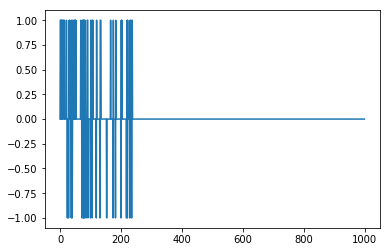

# Perceptron Simples


```python
from random import choice
from numpy import array, dot, random
from pylab import plot
%matplotlib inline
```


```python
gatilho = lambda x: 0 if x < 1 else 1
```


```python
treino = [ 
    (array([0,0,0]), 1),
    (array([0,0,1]), 1),
    (array([0,1,0]), 1),
    (array([0,1,1]), 1),
    (array([1,0,0]), 1),
    (array([1,0,1]), 1),
    (array([1,1,0]), 1),
    (array([1,1,1]), 0),
]
```


```python
peso = random.rand(3)
baias = random.rand(1)
taxa = 0.05
n = 1000
```


```python
erros = [] 

for i in range(n): 
    x, experado = choice(treino)
    resultado = dot(peso, x) + baias
    erro = experado - gatilho(resultado) 
    erros.append(erro)
    print("x = %s peso = %s baias = %s experado = %s y = %s e = %s" % (x, peso, baias, experado, gatilho(resultado), erro))
    if erro != 0:
        peso += taxa * erro * x
        baias += taxa * erro * baias
    
plot(erros)
```

    x = [1 0 1] peso = [ 0.44273692  0.18668797  0.22965729] baias = [ 0.39796951] experado = 1 y = 1 e = 0
    x = [1 0 0] peso = [ 0.44273692  0.18668797  0.22965729] baias = [ 0.39796951] experado = 1 y = 0 e = 1
    x = [0 0 1] peso = [ 0.49273692  0.18668797  0.22965729] baias = [ 0.41786799] experado = 1 y = 0 e = 1
    x = [1 1 0] peso = [ 0.49273692  0.18668797  0.27965729] baias = [ 0.43876139] experado = 1 y = 1 e = 0
    x = [0 0 1] peso = [ 0.49273692  0.18668797  0.27965729] baias = [ 0.43876139] experado = 1 y = 0 e = 1
    x = [1 0 0] peso = [ 0.49273692  0.18668797  0.32965729] baias = [ 0.46069946] experado = 1 y = 0 e = 1
    x = [1 1 0] peso = [ 0.54273692  0.18668797  0.32965729] baias = [ 0.48373443] experado = 1 y = 1 e = 0
    x = [0 0 1] peso = [ 0.54273692  0.18668797  0.32965729] baias = [ 0.48373443] experado = 1 y = 0 e = 1
    x = [1 0 1] peso = [ 0.54273692  0.18668797  0.37965729] baias = [ 0.50792115] experado = 1 y = 1 e = 0
    x = [1 0 1] peso = [ 0.54273692  0.18668797  0.37965729] baias = [ 0.50792115] experado = 1 y = 1 e = 0
    x = [0 1 0] peso = [ 0.54273692  0.18668797  0.37965729] baias = [ 0.50792115] experado = 1 y = 0 e = 1
    x = [0 1 0] peso = [ 0.54273692  0.23668797  0.37965729] baias = [ 0.53331721] experado = 1 y = 0 e = 1
    x = [0 0 1] peso = [ 0.54273692  0.28668797  0.37965729] baias = [ 0.55998307] experado = 1 y = 0 e = 1
    x = [1 1 0] peso = [ 0.54273692  0.28668797  0.42965729] baias = [ 0.58798223] experado = 1 y = 1 e = 0
    x = [0 1 0] peso = [ 0.54273692  0.28668797  0.42965729] baias = [ 0.58798223] experado = 1 y = 0 e = 1
    x = [0 1 1] peso = [ 0.54273692  0.33668797  0.42965729] baias = [ 0.61738134] experado = 1 y = 1 e = 0
    x = [0 1 1] peso = [ 0.54273692  0.33668797  0.42965729] baias = [ 0.61738134] experado = 1 y = 1 e = 0
    x = [0 1 1] peso = [ 0.54273692  0.33668797  0.42965729] baias = [ 0.61738134] experado = 1 y = 1 e = 0
    x = [1 0 0] peso = [ 0.54273692  0.33668797  0.42965729] baias = [ 0.61738134] experado = 1 y = 1 e = 0
    x = [1 0 0] peso = [ 0.54273692  0.33668797  0.42965729] baias = [ 0.61738134] experado = 1 y = 1 e = 0
    x = [1 1 0] peso = [ 0.54273692  0.33668797  0.42965729] baias = [ 0.61738134] experado = 1 y = 1 e = 0
    x = [0 1 0] peso = [ 0.54273692  0.33668797  0.42965729] baias = [ 0.61738134] experado = 1 y = 0 e = 1
    x = [0 1 0] peso = [ 0.54273692  0.38668797  0.42965729] baias = [ 0.6482504] experado = 1 y = 1 e = 0
    x = [0 0 1] peso = [ 0.54273692  0.38668797  0.42965729] baias = [ 0.6482504] experado = 1 y = 1 e = 0
    x = [1 1 1] peso = [ 0.54273692  0.38668797  0.42965729] baias = [ 0.6482504] experado = 0 y = 1 e = -1
    x = [1 0 0] peso = [ 0.49273692  0.33668797  0.37965729] baias = [ 0.61583788] experado = 1 y = 1 e = 0
    x = [1 1 0] peso = [ 0.49273692  0.33668797  0.37965729] baias = [ 0.61583788] experado = 1 y = 1 e = 0
    x = [1 1 0] peso = [ 0.49273692  0.33668797  0.37965729] baias = [ 0.61583788] experado = 1 y = 1 e = 0
    x = [1 1 1] peso = [ 0.49273692  0.33668797  0.37965729] baias = [ 0.61583788] experado = 0 y = 1 e = -1
    x = [0 1 1] peso = [ 0.44273692  0.28668797  0.32965729] baias = [ 0.58504599] experado = 1 y = 1 e = 0
    x = [0 0 1] peso = [ 0.44273692  0.28668797  0.32965729] baias = [ 0.58504599] experado = 1 y = 0 e = 1
    x = [1 0 0] peso = [ 0.44273692  0.28668797  0.37965729] baias = [ 0.61429829] experado = 1 y = 1 e = 0
    x = [0 0 0] peso = [ 0.44273692  0.28668797  0.37965729] baias = [ 0.61429829] experado = 1 y = 0 e = 1
    x = [1 1 0] peso = [ 0.44273692  0.28668797  0.37965729] baias = [ 0.6450132] experado = 1 y = 1 e = 0
    x = [1 0 1] peso = [ 0.44273692  0.28668797  0.37965729] baias = [ 0.6450132] experado = 1 y = 1 e = 0
    x = [0 1 1] peso = [ 0.44273692  0.28668797  0.37965729] baias = [ 0.6450132] experado = 1 y = 1 e = 0
    x = [0 1 1] peso = [ 0.44273692  0.28668797  0.37965729] baias = [ 0.6450132] experado = 1 y = 1 e = 0
    x = [1 1 1] peso = [ 0.44273692  0.28668797  0.37965729] baias = [ 0.6450132] experado = 0 y = 1 e = -1
    x = [0 0 0] peso = [ 0.39273692  0.23668797  0.32965729] baias = [ 0.61276254] experado = 1 y = 0 e = 1
    x = [0 0 0] peso = [ 0.39273692  0.23668797  0.32965729] baias = [ 0.64340067] experado = 1 y = 0 e = 1
    x = [1 1 1] peso = [ 0.39273692  0.23668797  0.32965729] baias = [ 0.6755707] experado = 0 y = 1 e = -1
    x = [1 0 1] peso = [ 0.34273692  0.18668797  0.27965729] baias = [ 0.64179217] experado = 1 y = 1 e = 0
    x = [0 1 1] peso = [ 0.34273692  0.18668797  0.27965729] baias = [ 0.64179217] experado = 1 y = 1 e = 0
    x = [0 0 0] peso = [ 0.34273692  0.18668797  0.27965729] baias = [ 0.64179217] experado = 1 y = 0 e = 1
    x = [1 0 1] peso = [ 0.34273692  0.18668797  0.27965729] baias = [ 0.67388178] experado = 1 y = 1 e = 0
    x = [1 0 0] peso = [ 0.34273692  0.18668797  0.27965729] baias = [ 0.67388178] experado = 1 y = 1 e = 0
    x = [0 1 1] peso = [ 0.34273692  0.18668797  0.27965729] baias = [ 0.67388178] experado = 1 y = 1 e = 0
    x = [0 1 0] peso = [ 0.34273692  0.18668797  0.27965729] baias = [ 0.67388178] experado = 1 y = 0 e = 1
    x = [0 0 0] peso = [ 0.34273692  0.23668797  0.27965729] baias = [ 0.70757587] experado = 1 y = 0 e = 1
    x = [1 0 1] peso = [ 0.34273692  0.23668797  0.27965729] baias = [ 0.74295466] experado = 1 y = 1 e = 0
    x = [0 0 0] peso = [ 0.34273692  0.23668797  0.27965729] baias = [ 0.74295466] experado = 1 y = 0 e = 1
    x = [0 1 0] peso = [ 0.34273692  0.23668797  0.27965729] baias = [ 0.78010239] experado = 1 y = 1 e = 0
    x = [0 0 0] peso = [ 0.34273692  0.23668797  0.27965729] baias = [ 0.78010239] experado = 1 y = 0 e = 1
    x = [0 1 1] peso = [ 0.34273692  0.23668797  0.27965729] baias = [ 0.81910751] experado = 1 y = 1 e = 0
    x = [0 1 1] peso = [ 0.34273692  0.23668797  0.27965729] baias = [ 0.81910751] experado = 1 y = 1 e = 0
    x = [1 0 0] peso = [ 0.34273692  0.23668797  0.27965729] baias = [ 0.81910751] experado = 1 y = 1 e = 0
    x = [1 1 0] peso = [ 0.34273692  0.23668797  0.27965729] baias = [ 0.81910751] experado = 1 y = 1 e = 0
    x = [0 1 0] peso = [ 0.34273692  0.23668797  0.27965729] baias = [ 0.81910751] experado = 1 y = 1 e = 0
    x = [1 0 0] peso = [ 0.34273692  0.23668797  0.27965729] baias = [ 0.81910751] experado = 1 y = 1 e = 0
    x = [0 1 1] peso = [ 0.34273692  0.23668797  0.27965729] baias = [ 0.81910751] experado = 1 y = 1 e = 0
    x = [1 0 0] peso = [ 0.34273692  0.23668797  0.27965729] baias = [ 0.81910751] experado = 1 y = 1 e = 0
    x = [1 1 0] peso = [ 0.34273692  0.23668797  0.27965729] baias = [ 0.81910751] experado = 1 y = 1 e = 0
    x = [0 1 1] peso = [ 0.34273692  0.23668797  0.27965729] baias = [ 0.81910751] experado = 1 y = 1 e = 0
    x = [0 1 1] peso = [ 0.34273692  0.23668797  0.27965729] baias = [ 0.81910751] experado = 1 y = 1 e = 0
    x = [0 1 0] peso = [ 0.34273692  0.23668797  0.27965729] baias = [ 0.81910751] experado = 1 y = 1 e = 0
    x = [1 0 1] peso = [ 0.34273692  0.23668797  0.27965729] baias = [ 0.81910751] experado = 1 y = 1 e = 0
    x = [1 1 0] peso = [ 0.34273692  0.23668797  0.27965729] baias = [ 0.81910751] experado = 1 y = 1 e = 0
    x = [1 1 0] peso = [ 0.34273692  0.23668797  0.27965729] baias = [ 0.81910751] experado = 1 y = 1 e = 0
    x = [0 0 0] peso = [ 0.34273692  0.23668797  0.27965729] baias = [ 0.81910751] experado = 1 y = 0 e = 1
    x = [0 1 0] peso = [ 0.34273692  0.23668797  0.27965729] baias = [ 0.86006289] experado = 1 y = 1 e = 0
    x = [1 0 1] peso = [ 0.34273692  0.23668797  0.27965729] baias = [ 0.86006289] experado = 1 y = 1 e = 0
    x = [1 0 0] peso = [ 0.34273692  0.23668797  0.27965729] baias = [ 0.86006289] experado = 1 y = 1 e = 0
    x = [1 1 1] peso = [ 0.34273692  0.23668797  0.27965729] baias = [ 0.86006289] experado = 0 y = 1 e = -1
    x = [0 0 0] peso = [ 0.29273692  0.18668797  0.22965729] baias = [ 0.81705974] experado = 1 y = 0 e = 1
    x = [0 0 0] peso = [ 0.29273692  0.18668797  0.22965729] baias = [ 0.85791273] experado = 1 y = 0 e = 1
    x = [1 1 0] peso = [ 0.29273692  0.18668797  0.22965729] baias = [ 0.90080837] experado = 1 y = 1 e = 0
    x = [1 1 1] peso = [ 0.29273692  0.18668797  0.22965729] baias = [ 0.90080837] experado = 0 y = 1 e = -1
    x = [0 0 0] peso = [ 0.24273692  0.13668797  0.17965729] baias = [ 0.85576795] experado = 1 y = 0 e = 1
    x = [1 1 1] peso = [ 0.24273692  0.13668797  0.17965729] baias = [ 0.89855635] experado = 0 y = 1 e = -1
    x = [0 0 1] peso = [ 0.19273692  0.08668797  0.12965729] baias = [ 0.85362853] experado = 1 y = 0 e = 1
    x = [0 1 0] peso = [ 0.19273692  0.08668797  0.17965729] baias = [ 0.89630995] experado = 1 y = 0 e = 1
    x = [1 1 1] peso = [ 0.19273692  0.13668797  0.17965729] baias = [ 0.94112545] experado = 0 y = 1 e = -1
    x = [0 0 0] peso = [ 0.14273692  0.08668797  0.12965729] baias = [ 0.89406918] experado = 1 y = 0 e = 1
    x = [1 0 0] peso = [ 0.14273692  0.08668797  0.12965729] baias = [ 0.93877264] experado = 1 y = 1 e = 0
    x = [1 0 0] peso = [ 0.14273692  0.08668797  0.12965729] baias = [ 0.93877264] experado = 1 y = 1 e = 0
    x = [1 1 0] peso = [ 0.14273692  0.08668797  0.12965729] baias = [ 0.93877264] experado = 1 y = 1 e = 0
    x = [1 1 1] peso = [ 0.14273692  0.08668797  0.12965729] baias = [ 0.93877264] experado = 0 y = 1 e = -1
    x = [0 1 1] peso = [ 0.09273692  0.03668797  0.07965729] baias = [ 0.89183401] experado = 1 y = 1 e = 0
    x = [0 1 1] peso = [ 0.09273692  0.03668797  0.07965729] baias = [ 0.89183401] experado = 1 y = 1 e = 0
    x = [0 0 1] peso = [ 0.09273692  0.03668797  0.07965729] baias = [ 0.89183401] experado = 1 y = 0 e = 1
    x = [0 0 0] peso = [ 0.09273692  0.03668797  0.12965729] baias = [ 0.93642571] experado = 1 y = 0 e = 1
    x = [0 0 0] peso = [ 0.09273692  0.03668797  0.12965729] baias = [ 0.98324699] experado = 1 y = 0 e = 1
    x = [1 1 1] peso = [ 0.09273692  0.03668797  0.12965729] baias = [ 1.03240934] experado = 0 y = 1 e = -1
    x = [1 0 1] peso = [ 0.04273692 -0.01331203  0.07965729] baias = [ 0.98078887] experado = 1 y = 1 e = 0
    x = [1 0 1] peso = [ 0.04273692 -0.01331203  0.07965729] baias = [ 0.98078887] experado = 1 y = 1 e = 0
    x = [1 0 0] peso = [ 0.04273692 -0.01331203  0.07965729] baias = [ 0.98078887] experado = 1 y = 1 e = 0
    x = [1 0 1] peso = [ 0.04273692 -0.01331203  0.07965729] baias = [ 0.98078887] experado = 1 y = 1 e = 0
    x = [0 0 1] peso = [ 0.04273692 -0.01331203  0.07965729] baias = [ 0.98078887] experado = 1 y = 1 e = 0
    x = [1 0 1] peso = [ 0.04273692 -0.01331203  0.07965729] baias = [ 0.98078887] experado = 1 y = 1 e = 0
    x = [1 0 0] peso = [ 0.04273692 -0.01331203  0.07965729] baias = [ 0.98078887] experado = 1 y = 1 e = 0
    x = [1 1 1] peso = [ 0.04273692 -0.01331203  0.07965729] baias = [ 0.98078887] experado = 0 y = 1 e = -1
    x = [1 1 0] peso = [-0.00726308 -0.06331203  0.02965729] baias = [ 0.93174943] experado = 1 y = 0 e = 1
    x = [1 0 1] peso = [ 0.04273692 -0.01331203  0.02965729] baias = [ 0.9783369] experado = 1 y = 1 e = 0
    x = [1 1 0] peso = [ 0.04273692 -0.01331203  0.02965729] baias = [ 0.9783369] experado = 1 y = 1 e = 0
    x = [1 0 0] peso = [ 0.04273692 -0.01331203  0.02965729] baias = [ 0.9783369] experado = 1 y = 1 e = 0
    x = [1 1 1] peso = [ 0.04273692 -0.01331203  0.02965729] baias = [ 0.9783369] experado = 0 y = 1 e = -1
    x = [1 1 0] peso = [-0.00726308 -0.06331203 -0.02034271] baias = [ 0.92942006] experado = 1 y = 0 e = 1
    x = [1 1 0] peso = [ 0.04273692 -0.01331203 -0.02034271] baias = [ 0.97589106] experado = 1 y = 1 e = 0
    x = [0 0 1] peso = [ 0.04273692 -0.01331203 -0.02034271] baias = [ 0.97589106] experado = 1 y = 0 e = 1
    x = [1 0 0] peso = [ 0.04273692 -0.01331203  0.02965729] baias = [ 1.02468561] experado = 1 y = 1 e = 0
    x = [0 1 1] peso = [ 0.04273692 -0.01331203  0.02965729] baias = [ 1.02468561] experado = 1 y = 1 e = 0
    x = [0 1 0] peso = [ 0.04273692 -0.01331203  0.02965729] baias = [ 1.02468561] experado = 1 y = 1 e = 0
    x = [0 1 1] peso = [ 0.04273692 -0.01331203  0.02965729] baias = [ 1.02468561] experado = 1 y = 1 e = 0
    x = [1 0 1] peso = [ 0.04273692 -0.01331203  0.02965729] baias = [ 1.02468561] experado = 1 y = 1 e = 0
    x = [1 1 0] peso = [ 0.04273692 -0.01331203  0.02965729] baias = [ 1.02468561] experado = 1 y = 1 e = 0
    x = [1 0 1] peso = [ 0.04273692 -0.01331203  0.02965729] baias = [ 1.02468561] experado = 1 y = 1 e = 0
    x = [0 1 0] peso = [ 0.04273692 -0.01331203  0.02965729] baias = [ 1.02468561] experado = 1 y = 1 e = 0
    x = [0 0 1] peso = [ 0.04273692 -0.01331203  0.02965729] baias = [ 1.02468561] experado = 1 y = 1 e = 0
    x = [1 1 0] peso = [ 0.04273692 -0.01331203  0.02965729] baias = [ 1.02468561] experado = 1 y = 1 e = 0
    x = [1 1 1] peso = [ 0.04273692 -0.01331203  0.02965729] baias = [ 1.02468561] experado = 0 y = 1 e = -1
    x = [0 1 1] peso = [-0.00726308 -0.06331203 -0.02034271] baias = [ 0.97345133] experado = 1 y = 0 e = 1
    x = [0 0 0] peso = [-0.00726308 -0.01331203  0.02965729] baias = [ 1.0221239] experado = 1 y = 1 e = 0
    x = [1 0 1] peso = [-0.00726308 -0.01331203  0.02965729] baias = [ 1.0221239] experado = 1 y = 1 e = 0
    x = [1 1 0] peso = [-0.00726308 -0.01331203  0.02965729] baias = [ 1.0221239] experado = 1 y = 1 e = 0
    x = [0 0 1] peso = [-0.00726308 -0.01331203  0.02965729] baias = [ 1.0221239] experado = 1 y = 1 e = 0
    x = [1 0 0] peso = [-0.00726308 -0.01331203  0.02965729] baias = [ 1.0221239] experado = 1 y = 1 e = 0
    x = [1 0 0] peso = [-0.00726308 -0.01331203  0.02965729] baias = [ 1.0221239] experado = 1 y = 1 e = 0
    x = [0 0 1] peso = [-0.00726308 -0.01331203  0.02965729] baias = [ 1.0221239] experado = 1 y = 1 e = 0
    x = [1 0 0] peso = [-0.00726308 -0.01331203  0.02965729] baias = [ 1.0221239] experado = 1 y = 1 e = 0
    x = [1 0 0] peso = [-0.00726308 -0.01331203  0.02965729] baias = [ 1.0221239] experado = 1 y = 1 e = 0
    x = [1 0 1] peso = [-0.00726308 -0.01331203  0.02965729] baias = [ 1.0221239] experado = 1 y = 1 e = 0
    x = [1 1 1] peso = [-0.00726308 -0.01331203  0.02965729] baias = [ 1.0221239] experado = 0 y = 1 e = -1
    x = [0 0 0] peso = [-0.05726308 -0.06331203 -0.02034271] baias = [ 0.9710177] experado = 1 y = 0 e = 1
    x = [1 0 1] peso = [-0.05726308 -0.06331203 -0.02034271] baias = [ 1.01956859] experado = 1 y = 0 e = 1
    x = [1 1 0] peso = [-0.00726308 -0.06331203  0.02965729] baias = [ 1.07054702] experado = 1 y = 0 e = 1
    x = [0 0 1] peso = [ 0.04273692 -0.01331203  0.02965729] baias = [ 1.12407437] experado = 1 y = 1 e = 0
    x = [0 0 1] peso = [ 0.04273692 -0.01331203  0.02965729] baias = [ 1.12407437] experado = 1 y = 1 e = 0
    x = [1 0 0] peso = [ 0.04273692 -0.01331203  0.02965729] baias = [ 1.12407437] experado = 1 y = 1 e = 0
    x = [0 1 1] peso = [ 0.04273692 -0.01331203  0.02965729] baias = [ 1.12407437] experado = 1 y = 1 e = 0
    x = [0 0 1] peso = [ 0.04273692 -0.01331203  0.02965729] baias = [ 1.12407437] experado = 1 y = 1 e = 0
    x = [0 1 0] peso = [ 0.04273692 -0.01331203  0.02965729] baias = [ 1.12407437] experado = 1 y = 1 e = 0
    x = [1 0 0] peso = [ 0.04273692 -0.01331203  0.02965729] baias = [ 1.12407437] experado = 1 y = 1 e = 0
    x = [0 0 0] peso = [ 0.04273692 -0.01331203  0.02965729] baias = [ 1.12407437] experado = 1 y = 1 e = 0
    x = [0 0 1] peso = [ 0.04273692 -0.01331203  0.02965729] baias = [ 1.12407437] experado = 1 y = 1 e = 0
    x = [0 0 0] peso = [ 0.04273692 -0.01331203  0.02965729] baias = [ 1.12407437] experado = 1 y = 1 e = 0
    x = [1 1 0] peso = [ 0.04273692 -0.01331203  0.02965729] baias = [ 1.12407437] experado = 1 y = 1 e = 0
    x = [1 0 0] peso = [ 0.04273692 -0.01331203  0.02965729] baias = [ 1.12407437] experado = 1 y = 1 e = 0
    x = [0 0 1] peso = [ 0.04273692 -0.01331203  0.02965729] baias = [ 1.12407437] experado = 1 y = 1 e = 0
    x = [1 0 0] peso = [ 0.04273692 -0.01331203  0.02965729] baias = [ 1.12407437] experado = 1 y = 1 e = 0
    x = [0 1 1] peso = [ 0.04273692 -0.01331203  0.02965729] baias = [ 1.12407437] experado = 1 y = 1 e = 0
    x = [0 1 1] peso = [ 0.04273692 -0.01331203  0.02965729] baias = [ 1.12407437] experado = 1 y = 1 e = 0
    x = [0 0 0] peso = [ 0.04273692 -0.01331203  0.02965729] baias = [ 1.12407437] experado = 1 y = 1 e = 0
    x = [1 0 0] peso = [ 0.04273692 -0.01331203  0.02965729] baias = [ 1.12407437] experado = 1 y = 1 e = 0
    x = [1 1 1] peso = [ 0.04273692 -0.01331203  0.02965729] baias = [ 1.12407437] experado = 0 y = 1 e = -1
    x = [1 0 1] peso = [-0.00726308 -0.06331203 -0.02034271] baias = [ 1.06787065] experado = 1 y = 1 e = 0
    x = [1 1 1] peso = [-0.00726308 -0.06331203 -0.02034271] baias = [ 1.06787065] experado = 0 y = 0 e = 0
    x = [0 0 1] peso = [-0.00726308 -0.06331203 -0.02034271] baias = [ 1.06787065] experado = 1 y = 1 e = 0
    x = [1 1 1] peso = [-0.00726308 -0.06331203 -0.02034271] baias = [ 1.06787065] experado = 0 y = 0 e = 0
    x = [1 0 0] peso = [-0.00726308 -0.06331203 -0.02034271] baias = [ 1.06787065] experado = 1 y = 1 e = 0
    x = [1 0 0] peso = [-0.00726308 -0.06331203 -0.02034271] baias = [ 1.06787065] experado = 1 y = 1 e = 0
    x = [1 0 0] peso = [-0.00726308 -0.06331203 -0.02034271] baias = [ 1.06787065] experado = 1 y = 1 e = 0
    x = [0 1 0] peso = [-0.00726308 -0.06331203 -0.02034271] baias = [ 1.06787065] experado = 1 y = 1 e = 0
    x = [1 1 1] peso = [-0.00726308 -0.06331203 -0.02034271] baias = [ 1.06787065] experado = 0 y = 0 e = 0
    x = [1 0 0] peso = [-0.00726308 -0.06331203 -0.02034271] baias = [ 1.06787065] experado = 1 y = 1 e = 0
    x = [1 0 1] peso = [-0.00726308 -0.06331203 -0.02034271] baias = [ 1.06787065] experado = 1 y = 1 e = 0
    x = [0 0 1] peso = [-0.00726308 -0.06331203 -0.02034271] baias = [ 1.06787065] experado = 1 y = 1 e = 0
    x = [1 1 0] peso = [-0.00726308 -0.06331203 -0.02034271] baias = [ 1.06787065] experado = 1 y = 0 e = 1
    x = [0 1 1] peso = [ 0.04273692 -0.01331203 -0.02034271] baias = [ 1.12126418] experado = 1 y = 1 e = 0
    x = [1 0 0] peso = [ 0.04273692 -0.01331203 -0.02034271] baias = [ 1.12126418] experado = 1 y = 1 e = 0
    x = [0 1 0] peso = [ 0.04273692 -0.01331203 -0.02034271] baias = [ 1.12126418] experado = 1 y = 1 e = 0
    x = [0 1 1] peso = [ 0.04273692 -0.01331203 -0.02034271] baias = [ 1.12126418] experado = 1 y = 1 e = 0
    x = [0 0 1] peso = [ 0.04273692 -0.01331203 -0.02034271] baias = [ 1.12126418] experado = 1 y = 1 e = 0
    x = [1 1 0] peso = [ 0.04273692 -0.01331203 -0.02034271] baias = [ 1.12126418] experado = 1 y = 1 e = 0
    x = [0 0 0] peso = [ 0.04273692 -0.01331203 -0.02034271] baias = [ 1.12126418] experado = 1 y = 1 e = 0
    x = [1 1 1] peso = [ 0.04273692 -0.01331203 -0.02034271] baias = [ 1.12126418] experado = 0 y = 1 e = -1
    x = [1 1 0] peso = [-0.00726308 -0.06331203 -0.07034271] baias = [ 1.06520098] experado = 1 y = 0 e = 1
    x = [0 0 0] peso = [ 0.04273692 -0.01331203 -0.07034271] baias = [ 1.11846102] experado = 1 y = 1 e = 0
    x = [0 1 0] peso = [ 0.04273692 -0.01331203 -0.07034271] baias = [ 1.11846102] experado = 1 y = 1 e = 0
    x = [0 1 1] peso = [ 0.04273692 -0.01331203 -0.07034271] baias = [ 1.11846102] experado = 1 y = 1 e = 0
    x = [1 1 0] peso = [ 0.04273692 -0.01331203 -0.07034271] baias = [ 1.11846102] experado = 1 y = 1 e = 0
    x = [1 0 1] peso = [ 0.04273692 -0.01331203 -0.07034271] baias = [ 1.11846102] experado = 1 y = 1 e = 0
    x = [0 0 1] peso = [ 0.04273692 -0.01331203 -0.07034271] baias = [ 1.11846102] experado = 1 y = 1 e = 0
    x = [1 1 1] peso = [ 0.04273692 -0.01331203 -0.07034271] baias = [ 1.11846102] experado = 0 y = 1 e = -1
    x = [0 1 1] peso = [-0.00726308 -0.06331203 -0.12034271] baias = [ 1.06253797] experado = 1 y = 0 e = 1
    x = [0 1 1] peso = [-0.00726308 -0.01331203 -0.07034271] baias = [ 1.11566487] experado = 1 y = 1 e = 0
    x = [1 0 1] peso = [-0.00726308 -0.01331203 -0.07034271] baias = [ 1.11566487] experado = 1 y = 1 e = 0
    x = [0 0 0] peso = [-0.00726308 -0.01331203 -0.07034271] baias = [ 1.11566487] experado = 1 y = 1 e = 0
    x = [0 0 0] peso = [-0.00726308 -0.01331203 -0.07034271] baias = [ 1.11566487] experado = 1 y = 1 e = 0
    x = [0 1 0] peso = [-0.00726308 -0.01331203 -0.07034271] baias = [ 1.11566487] experado = 1 y = 1 e = 0
    x = [0 0 0] peso = [-0.00726308 -0.01331203 -0.07034271] baias = [ 1.11566487] experado = 1 y = 1 e = 0
    x = [0 0 1] peso = [-0.00726308 -0.01331203 -0.07034271] baias = [ 1.11566487] experado = 1 y = 1 e = 0
    x = [1 1 0] peso = [-0.00726308 -0.01331203 -0.07034271] baias = [ 1.11566487] experado = 1 y = 1 e = 0
    x = [1 0 0] peso = [-0.00726308 -0.01331203 -0.07034271] baias = [ 1.11566487] experado = 1 y = 1 e = 0
    x = [0 1 0] peso = [-0.00726308 -0.01331203 -0.07034271] baias = [ 1.11566487] experado = 1 y = 1 e = 0
    x = [0 0 1] peso = [-0.00726308 -0.01331203 -0.07034271] baias = [ 1.11566487] experado = 1 y = 1 e = 0
    x = [0 0 1] peso = [-0.00726308 -0.01331203 -0.07034271] baias = [ 1.11566487] experado = 1 y = 1 e = 0
    x = [0 0 0] peso = [-0.00726308 -0.01331203 -0.07034271] baias = [ 1.11566487] experado = 1 y = 1 e = 0
    x = [0 0 0] peso = [-0.00726308 -0.01331203 -0.07034271] baias = [ 1.11566487] experado = 1 y = 1 e = 0
    x = [0 1 0] peso = [-0.00726308 -0.01331203 -0.07034271] baias = [ 1.11566487] experado = 1 y = 1 e = 0
    x = [1 0 0] peso = [-0.00726308 -0.01331203 -0.07034271] baias = [ 1.11566487] experado = 1 y = 1 e = 0
    x = [1 1 1] peso = [-0.00726308 -0.01331203 -0.07034271] baias = [ 1.11566487] experado = 0 y = 1 e = -1
    x = [1 1 0] peso = [-0.05726308 -0.06331203 -0.12034271] baias = [ 1.05988163] experado = 1 y = 0 e = 1
    x = [1 0 0] peso = [-0.00726308 -0.01331203 -0.12034271] baias = [ 1.11287571] experado = 1 y = 1 e = 0
    x = [0 1 1] peso = [-0.00726308 -0.01331203 -0.12034271] baias = [ 1.11287571] experado = 1 y = 0 e = 1
    x = [0 0 0] peso = [-0.00726308  0.03668797 -0.07034271] baias = [ 1.16851949] experado = 1 y = 1 e = 0
    x = [0 0 0] peso = [-0.00726308  0.03668797 -0.07034271] baias = [ 1.16851949] experado = 1 y = 1 e = 0
    x = [1 0 1] peso = [-0.00726308  0.03668797 -0.07034271] baias = [ 1.16851949] experado = 1 y = 1 e = 0
    x = [1 0 0] peso = [-0.00726308  0.03668797 -0.07034271] baias = [ 1.16851949] experado = 1 y = 1 e = 0
    x = [1 1 0] peso = [-0.00726308  0.03668797 -0.07034271] baias = [ 1.16851949] experado = 1 y = 1 e = 0
    x = [1 1 0] peso = [-0.00726308  0.03668797 -0.07034271] baias = [ 1.16851949] experado = 1 y = 1 e = 0
    x = [1 0 0] peso = [-0.00726308  0.03668797 -0.07034271] baias = [ 1.16851949] experado = 1 y = 1 e = 0
    x = [1 1 0] peso = [-0.00726308  0.03668797 -0.07034271] baias = [ 1.16851949] experado = 1 y = 1 e = 0
    x = [0 1 0] peso = [-0.00726308  0.03668797 -0.07034271] baias = [ 1.16851949] experado = 1 y = 1 e = 0
    x = [1 0 0] peso = [-0.00726308  0.03668797 -0.07034271] baias = [ 1.16851949] experado = 1 y = 1 e = 0
    x = [0 1 0] peso = [-0.00726308  0.03668797 -0.07034271] baias = [ 1.16851949] experado = 1 y = 1 e = 0
    x = [0 0 1] peso = [-0.00726308  0.03668797 -0.07034271] baias = [ 1.16851949] experado = 1 y = 1 e = 0
    x = [1 0 1] peso = [-0.00726308  0.03668797 -0.07034271] baias = [ 1.16851949] experado = 1 y = 1 e = 0
    x = [0 1 1] peso = [-0.00726308  0.03668797 -0.07034271] baias = [ 1.16851949] experado = 1 y = 1 e = 0
    x = [1 1 1] peso = [-0.00726308  0.03668797 -0.07034271] baias = [ 1.16851949] experado = 0 y = 1 e = -1
    x = [1 0 0] peso = [-0.05726308 -0.01331203 -0.12034271] baias = [ 1.11009352] experado = 1 y = 1 e = 0
    x = [0 1 1] peso = [-0.05726308 -0.01331203 -0.12034271] baias = [ 1.11009352] experado = 1 y = 0 e = 1
    x = [1 1 1] peso = [-0.05726308  0.03668797 -0.07034271] baias = [ 1.1655982] experado = 0 y = 1 e = -1
    x = [1 1 0] peso = [-0.10726308 -0.01331203 -0.12034271] baias = [ 1.10731829] experado = 1 y = 0 e = 1
    x = [0 0 0] peso = [-0.05726308  0.03668797 -0.12034271] baias = [ 1.1626842] experado = 1 y = 1 e = 0
    x = [0 1 1] peso = [-0.05726308  0.03668797 -0.12034271] baias = [ 1.1626842] experado = 1 y = 1 e = 0
    x = [0 0 0] peso = [-0.05726308  0.03668797 -0.12034271] baias = [ 1.1626842] experado = 1 y = 1 e = 0
    x = [0 1 1] peso = [-0.05726308  0.03668797 -0.12034271] baias = [ 1.1626842] experado = 1 y = 1 e = 0
    x = [0 1 1] peso = [-0.05726308  0.03668797 -0.12034271] baias = [ 1.1626842] experado = 1 y = 1 e = 0
    x = [0 1 1] peso = [-0.05726308  0.03668797 -0.12034271] baias = [ 1.1626842] experado = 1 y = 1 e = 0
    x = [1 1 1] peso = [-0.05726308  0.03668797 -0.12034271] baias = [ 1.1626842] experado = 0 y = 1 e = -1
    x = [1 0 0] peso = [-0.10726308 -0.01331203 -0.17034271] baias = [ 1.10454999] experado = 1 y = 0 e = 1
    x = [0 1 0] peso = [-0.05726308 -0.01331203 -0.17034271] baias = [ 1.15977749] experado = 1 y = 1 e = 0
    x = [1 1 0] peso = [-0.05726308 -0.01331203 -0.17034271] baias = [ 1.15977749] experado = 1 y = 1 e = 0
    x = [0 0 1] peso = [-0.05726308 -0.01331203 -0.17034271] baias = [ 1.15977749] experado = 1 y = 0 e = 1
    x = [1 0 0] peso = [-0.05726308 -0.01331203 -0.12034271] baias = [ 1.21776636] experado = 1 y = 1 e = 0
    x = [1 1 1] peso = [-0.05726308 -0.01331203 -0.12034271] baias = [ 1.21776636] experado = 0 y = 1 e = -1
    x = [1 0 0] peso = [-0.10726308 -0.06331203 -0.17034271] baias = [ 1.15687805] experado = 1 y = 1 e = 0
    x = [1 0 1] peso = [-0.10726308 -0.06331203 -0.17034271] baias = [ 1.15687805] experado = 1 y = 0 e = 1
    x = [1 1 1] peso = [-0.05726308 -0.06331203 -0.12034271] baias = [ 1.21472195] experado = 0 y = 0 e = 0
    x = [1 0 0] peso = [-0.05726308 -0.06331203 -0.12034271] baias = [ 1.21472195] experado = 1 y = 1 e = 0
    x = [1 0 1] peso = [-0.05726308 -0.06331203 -0.12034271] baias = [ 1.21472195] experado = 1 y = 1 e = 0
    x = [0 0 1] peso = [-0.05726308 -0.06331203 -0.12034271] baias = [ 1.21472195] experado = 1 y = 1 e = 0
    x = [0 1 1] peso = [-0.05726308 -0.06331203 -0.12034271] baias = [ 1.21472195] experado = 1 y = 1 e = 0
    x = [1 0 1] peso = [-0.05726308 -0.06331203 -0.12034271] baias = [ 1.21472195] experado = 1 y = 1 e = 0
    x = [0 1 1] peso = [-0.05726308 -0.06331203 -0.12034271] baias = [ 1.21472195] experado = 1 y = 1 e = 0
    x = [1 1 1] peso = [-0.05726308 -0.06331203 -0.12034271] baias = [ 1.21472195] experado = 0 y = 0 e = 0
    x = [1 0 0] peso = [-0.05726308 -0.06331203 -0.12034271] baias = [ 1.21472195] experado = 1 y = 1 e = 0
    x = [0 0 0] peso = [-0.05726308 -0.06331203 -0.12034271] baias = [ 1.21472195] experado = 1 y = 1 e = 0
    x = [1 1 0] peso = [-0.05726308 -0.06331203 -0.12034271] baias = [ 1.21472195] experado = 1 y = 1 e = 0
    x = [0 1 0] peso = [-0.05726308 -0.06331203 -0.12034271] baias = [ 1.21472195] experado = 1 y = 1 e = 0
    x = [1 0 0] peso = [-0.05726308 -0.06331203 -0.12034271] baias = [ 1.21472195] experado = 1 y = 1 e = 0
    x = [0 0 0] peso = [-0.05726308 -0.06331203 -0.12034271] baias = [ 1.21472195] experado = 1 y = 1 e = 0
    x = [1 0 0] peso = [-0.05726308 -0.06331203 -0.12034271] baias = [ 1.21472195] experado = 1 y = 1 e = 0
    x = [0 0 1] peso = [-0.05726308 -0.06331203 -0.12034271] baias = [ 1.21472195] experado = 1 y = 1 e = 0
    x = [1 1 1] peso = [-0.05726308 -0.06331203 -0.12034271] baias = [ 1.21472195] experado = 0 y = 0 e = 0
    x = [0 1 0] peso = [-0.05726308 -0.06331203 -0.12034271] baias = [ 1.21472195] experado = 1 y = 1 e = 0
    x = [1 1 1] peso = [-0.05726308 -0.06331203 -0.12034271] baias = [ 1.21472195] experado = 0 y = 0 e = 0
    x = [0 0 0] peso = [-0.05726308 -0.06331203 -0.12034271] baias = [ 1.21472195] experado = 1 y = 1 e = 0
    x = [0 0 1] peso = [-0.05726308 -0.06331203 -0.12034271] baias = [ 1.21472195] experado = 1 y = 1 e = 0
    x = [1 0 1] peso = [-0.05726308 -0.06331203 -0.12034271] baias = [ 1.21472195] experado = 1 y = 1 e = 0
    x = [0 0 0] peso = [-0.05726308 -0.06331203 -0.12034271] baias = [ 1.21472195] experado = 1 y = 1 e = 0
    x = [1 1 0] peso = [-0.05726308 -0.06331203 -0.12034271] baias = [ 1.21472195] experado = 1 y = 1 e = 0
    x = [1 0 1] peso = [-0.05726308 -0.06331203 -0.12034271] baias = [ 1.21472195] experado = 1 y = 1 e = 0
    x = [0 0 1] peso = [-0.05726308 -0.06331203 -0.12034271] baias = [ 1.21472195] experado = 1 y = 1 e = 0
    x = [1 0 1] peso = [-0.05726308 -0.06331203 -0.12034271] baias = [ 1.21472195] experado = 1 y = 1 e = 0
    x = [1 0 1] peso = [-0.05726308 -0.06331203 -0.12034271] baias = [ 1.21472195] experado = 1 y = 1 e = 0
    x = [1 1 1] peso = [-0.05726308 -0.06331203 -0.12034271] baias = [ 1.21472195] experado = 0 y = 0 e = 0
    x = [0 1 1] peso = [-0.05726308 -0.06331203 -0.12034271] baias = [ 1.21472195] experado = 1 y = 1 e = 0
    x = [0 1 0] peso = [-0.05726308 -0.06331203 -0.12034271] baias = [ 1.21472195] experado = 1 y = 1 e = 0
    x = [0 1 1] peso = [-0.05726308 -0.06331203 -0.12034271] baias = [ 1.21472195] experado = 1 y = 1 e = 0
    x = [0 0 1] peso = [-0.05726308 -0.06331203 -0.12034271] baias = [ 1.21472195] experado = 1 y = 1 e = 0
    x = [1 1 0] peso = [-0.05726308 -0.06331203 -0.12034271] baias = [ 1.21472195] experado = 1 y = 1 e = 0
    x = [1 1 1] peso = [-0.05726308 -0.06331203 -0.12034271] baias = [ 1.21472195] experado = 0 y = 0 e = 0
    x = [1 1 1] peso = [-0.05726308 -0.06331203 -0.12034271] baias = [ 1.21472195] experado = 0 y = 0 e = 0
    x = [0 0 1] peso = [-0.05726308 -0.06331203 -0.12034271] baias = [ 1.21472195] experado = 1 y = 1 e = 0
    x = [0 1 0] peso = [-0.05726308 -0.06331203 -0.12034271] baias = [ 1.21472195] experado = 1 y = 1 e = 0
    x = [0 0 0] peso = [-0.05726308 -0.06331203 -0.12034271] baias = [ 1.21472195] experado = 1 y = 1 e = 0
    x = [0 0 0] peso = [-0.05726308 -0.06331203 -0.12034271] baias = [ 1.21472195] experado = 1 y = 1 e = 0
    x = [0 0 0] peso = [-0.05726308 -0.06331203 -0.12034271] baias = [ 1.21472195] experado = 1 y = 1 e = 0
    x = [1 0 0] peso = [-0.05726308 -0.06331203 -0.12034271] baias = [ 1.21472195] experado = 1 y = 1 e = 0
    x = [0 0 0] peso = [-0.05726308 -0.06331203 -0.12034271] baias = [ 1.21472195] experado = 1 y = 1 e = 0
    x = [1 1 0] peso = [-0.05726308 -0.06331203 -0.12034271] baias = [ 1.21472195] experado = 1 y = 1 e = 0
    x = [0 0 1] peso = [-0.05726308 -0.06331203 -0.12034271] baias = [ 1.21472195] experado = 1 y = 1 e = 0
    x = [0 0 0] peso = [-0.05726308 -0.06331203 -0.12034271] baias = [ 1.21472195] experado = 1 y = 1 e = 0
    x = [1 0 1] peso = [-0.05726308 -0.06331203 -0.12034271] baias = [ 1.21472195] experado = 1 y = 1 e = 0
    x = [1 0 1] peso = [-0.05726308 -0.06331203 -0.12034271] baias = [ 1.21472195] experado = 1 y = 1 e = 0
    x = [1 1 0] peso = [-0.05726308 -0.06331203 -0.12034271] baias = [ 1.21472195] experado = 1 y = 1 e = 0
    x = [1 0 1] peso = [-0.05726308 -0.06331203 -0.12034271] baias = [ 1.21472195] experado = 1 y = 1 e = 0
    x = [1 0 1] peso = [-0.05726308 -0.06331203 -0.12034271] baias = [ 1.21472195] experado = 1 y = 1 e = 0
    x = [0 0 0] peso = [-0.05726308 -0.06331203 -0.12034271] baias = [ 1.21472195] experado = 1 y = 1 e = 0
    x = [0 1 1] peso = [-0.05726308 -0.06331203 -0.12034271] baias = [ 1.21472195] experado = 1 y = 1 e = 0
    x = [1 0 0] peso = [-0.05726308 -0.06331203 -0.12034271] baias = [ 1.21472195] experado = 1 y = 1 e = 0
    x = [0 0 0] peso = [-0.05726308 -0.06331203 -0.12034271] baias = [ 1.21472195] experado = 1 y = 1 e = 0
    x = [1 0 0] peso = [-0.05726308 -0.06331203 -0.12034271] baias = [ 1.21472195] experado = 1 y = 1 e = 0
    x = [1 1 1] peso = [-0.05726308 -0.06331203 -0.12034271] baias = [ 1.21472195] experado = 0 y = 0 e = 0
    x = [1 1 0] peso = [-0.05726308 -0.06331203 -0.12034271] baias = [ 1.21472195] experado = 1 y = 1 e = 0
    x = [1 1 1] peso = [-0.05726308 -0.06331203 -0.12034271] baias = [ 1.21472195] experado = 0 y = 0 e = 0
    x = [0 0 1] peso = [-0.05726308 -0.06331203 -0.12034271] baias = [ 1.21472195] experado = 1 y = 1 e = 0
    x = [1 0 1] peso = [-0.05726308 -0.06331203 -0.12034271] baias = [ 1.21472195] experado = 1 y = 1 e = 0
    x = [1 0 0] peso = [-0.05726308 -0.06331203 -0.12034271] baias = [ 1.21472195] experado = 1 y = 1 e = 0
    x = [1 1 0] peso = [-0.05726308 -0.06331203 -0.12034271] baias = [ 1.21472195] experado = 1 y = 1 e = 0
    x = [0 1 0] peso = [-0.05726308 -0.06331203 -0.12034271] baias = [ 1.21472195] experado = 1 y = 1 e = 0
    x = [0 0 1] peso = [-0.05726308 -0.06331203 -0.12034271] baias = [ 1.21472195] experado = 1 y = 1 e = 0
    x = [0 1 0] peso = [-0.05726308 -0.06331203 -0.12034271] baias = [ 1.21472195] experado = 1 y = 1 e = 0
    x = [0 1 1] peso = [-0.05726308 -0.06331203 -0.12034271] baias = [ 1.21472195] experado = 1 y = 1 e = 0
    x = [1 0 0] peso = [-0.05726308 -0.06331203 -0.12034271] baias = [ 1.21472195] experado = 1 y = 1 e = 0
    x = [0 1 1] peso = [-0.05726308 -0.06331203 -0.12034271] baias = [ 1.21472195] experado = 1 y = 1 e = 0
    x = [0 1 0] peso = [-0.05726308 -0.06331203 -0.12034271] baias = [ 1.21472195] experado = 1 y = 1 e = 0
    x = [1 1 0] peso = [-0.05726308 -0.06331203 -0.12034271] baias = [ 1.21472195] experado = 1 y = 1 e = 0
    x = [0 1 1] peso = [-0.05726308 -0.06331203 -0.12034271] baias = [ 1.21472195] experado = 1 y = 1 e = 0
    x = [1 1 0] peso = [-0.05726308 -0.06331203 -0.12034271] baias = [ 1.21472195] experado = 1 y = 1 e = 0
    x = [1 1 1] peso = [-0.05726308 -0.06331203 -0.12034271] baias = [ 1.21472195] experado = 0 y = 0 e = 0
    x = [1 0 0] peso = [-0.05726308 -0.06331203 -0.12034271] baias = [ 1.21472195] experado = 1 y = 1 e = 0
    x = [1 1 0] peso = [-0.05726308 -0.06331203 -0.12034271] baias = [ 1.21472195] experado = 1 y = 1 e = 0
    x = [1 1 0] peso = [-0.05726308 -0.06331203 -0.12034271] baias = [ 1.21472195] experado = 1 y = 1 e = 0
    x = [0 0 0] peso = [-0.05726308 -0.06331203 -0.12034271] baias = [ 1.21472195] experado = 1 y = 1 e = 0
    x = [1 1 1] peso = [-0.05726308 -0.06331203 -0.12034271] baias = [ 1.21472195] experado = 0 y = 0 e = 0
    x = [1 0 0] peso = [-0.05726308 -0.06331203 -0.12034271] baias = [ 1.21472195] experado = 1 y = 1 e = 0
    x = [0 0 0] peso = [-0.05726308 -0.06331203 -0.12034271] baias = [ 1.21472195] experado = 1 y = 1 e = 0
    x = [1 1 1] peso = [-0.05726308 -0.06331203 -0.12034271] baias = [ 1.21472195] experado = 0 y = 0 e = 0
    x = [0 0 0] peso = [-0.05726308 -0.06331203 -0.12034271] baias = [ 1.21472195] experado = 1 y = 1 e = 0
    x = [1 0 1] peso = [-0.05726308 -0.06331203 -0.12034271] baias = [ 1.21472195] experado = 1 y = 1 e = 0
    x = [1 0 0] peso = [-0.05726308 -0.06331203 -0.12034271] baias = [ 1.21472195] experado = 1 y = 1 e = 0
    x = [1 1 0] peso = [-0.05726308 -0.06331203 -0.12034271] baias = [ 1.21472195] experado = 1 y = 1 e = 0
    x = [1 1 1] peso = [-0.05726308 -0.06331203 -0.12034271] baias = [ 1.21472195] experado = 0 y = 0 e = 0
    x = [1 0 0] peso = [-0.05726308 -0.06331203 -0.12034271] baias = [ 1.21472195] experado = 1 y = 1 e = 0
    x = [1 0 0] peso = [-0.05726308 -0.06331203 -0.12034271] baias = [ 1.21472195] experado = 1 y = 1 e = 0
    x = [1 1 1] peso = [-0.05726308 -0.06331203 -0.12034271] baias = [ 1.21472195] experado = 0 y = 0 e = 0
    x = [1 1 0] peso = [-0.05726308 -0.06331203 -0.12034271] baias = [ 1.21472195] experado = 1 y = 1 e = 0
    x = [0 0 1] peso = [-0.05726308 -0.06331203 -0.12034271] baias = [ 1.21472195] experado = 1 y = 1 e = 0
    x = [1 1 1] peso = [-0.05726308 -0.06331203 -0.12034271] baias = [ 1.21472195] experado = 0 y = 0 e = 0
    x = [0 0 1] peso = [-0.05726308 -0.06331203 -0.12034271] baias = [ 1.21472195] experado = 1 y = 1 e = 0
    x = [0 1 1] peso = [-0.05726308 -0.06331203 -0.12034271] baias = [ 1.21472195] experado = 1 y = 1 e = 0
    x = [1 1 0] peso = [-0.05726308 -0.06331203 -0.12034271] baias = [ 1.21472195] experado = 1 y = 1 e = 0
    x = [0 1 1] peso = [-0.05726308 -0.06331203 -0.12034271] baias = [ 1.21472195] experado = 1 y = 1 e = 0
    x = [1 0 0] peso = [-0.05726308 -0.06331203 -0.12034271] baias = [ 1.21472195] experado = 1 y = 1 e = 0
    x = [1 0 0] peso = [-0.05726308 -0.06331203 -0.12034271] baias = [ 1.21472195] experado = 1 y = 1 e = 0
    x = [0 1 0] peso = [-0.05726308 -0.06331203 -0.12034271] baias = [ 1.21472195] experado = 1 y = 1 e = 0
    x = [1 1 1] peso = [-0.05726308 -0.06331203 -0.12034271] baias = [ 1.21472195] experado = 0 y = 0 e = 0
    x = [0 1 1] peso = [-0.05726308 -0.06331203 -0.12034271] baias = [ 1.21472195] experado = 1 y = 1 e = 0
    x = [0 1 1] peso = [-0.05726308 -0.06331203 -0.12034271] baias = [ 1.21472195] experado = 1 y = 1 e = 0
    x = [0 1 0] peso = [-0.05726308 -0.06331203 -0.12034271] baias = [ 1.21472195] experado = 1 y = 1 e = 0
    x = [0 1 1] peso = [-0.05726308 -0.06331203 -0.12034271] baias = [ 1.21472195] experado = 1 y = 1 e = 0
    x = [0 0 0] peso = [-0.05726308 -0.06331203 -0.12034271] baias = [ 1.21472195] experado = 1 y = 1 e = 0
    x = [1 0 0] peso = [-0.05726308 -0.06331203 -0.12034271] baias = [ 1.21472195] experado = 1 y = 1 e = 0
    x = [0 0 1] peso = [-0.05726308 -0.06331203 -0.12034271] baias = [ 1.21472195] experado = 1 y = 1 e = 0
    x = [1 1 1] peso = [-0.05726308 -0.06331203 -0.12034271] baias = [ 1.21472195] experado = 0 y = 0 e = 0
    x = [1 1 1] peso = [-0.05726308 -0.06331203 -0.12034271] baias = [ 1.21472195] experado = 0 y = 0 e = 0
    x = [1 1 0] peso = [-0.05726308 -0.06331203 -0.12034271] baias = [ 1.21472195] experado = 1 y = 1 e = 0
    x = [0 0 0] peso = [-0.05726308 -0.06331203 -0.12034271] baias = [ 1.21472195] experado = 1 y = 1 e = 0
    x = [0 1 1] peso = [-0.05726308 -0.06331203 -0.12034271] baias = [ 1.21472195] experado = 1 y = 1 e = 0
    x = [1 1 0] peso = [-0.05726308 -0.06331203 -0.12034271] baias = [ 1.21472195] experado = 1 y = 1 e = 0
    x = [0 1 0] peso = [-0.05726308 -0.06331203 -0.12034271] baias = [ 1.21472195] experado = 1 y = 1 e = 0
    x = [1 0 0] peso = [-0.05726308 -0.06331203 -0.12034271] baias = [ 1.21472195] experado = 1 y = 1 e = 0
    x = [0 0 0] peso = [-0.05726308 -0.06331203 -0.12034271] baias = [ 1.21472195] experado = 1 y = 1 e = 0
    x = [1 0 1] peso = [-0.05726308 -0.06331203 -0.12034271] baias = [ 1.21472195] experado = 1 y = 1 e = 0
    x = [0 0 0] peso = [-0.05726308 -0.06331203 -0.12034271] baias = [ 1.21472195] experado = 1 y = 1 e = 0
    x = [1 0 0] peso = [-0.05726308 -0.06331203 -0.12034271] baias = [ 1.21472195] experado = 1 y = 1 e = 0
    x = [0 1 1] peso = [-0.05726308 -0.06331203 -0.12034271] baias = [ 1.21472195] experado = 1 y = 1 e = 0
    x = [1 1 0] peso = [-0.05726308 -0.06331203 -0.12034271] baias = [ 1.21472195] experado = 1 y = 1 e = 0
    x = [0 1 1] peso = [-0.05726308 -0.06331203 -0.12034271] baias = [ 1.21472195] experado = 1 y = 1 e = 0
    x = [1 1 1] peso = [-0.05726308 -0.06331203 -0.12034271] baias = [ 1.21472195] experado = 0 y = 0 e = 0
    x = [0 1 0] peso = [-0.05726308 -0.06331203 -0.12034271] baias = [ 1.21472195] experado = 1 y = 1 e = 0
    x = [1 1 1] peso = [-0.05726308 -0.06331203 -0.12034271] baias = [ 1.21472195] experado = 0 y = 0 e = 0
    x = [0 0 0] peso = [-0.05726308 -0.06331203 -0.12034271] baias = [ 1.21472195] experado = 1 y = 1 e = 0
    x = [1 1 1] peso = [-0.05726308 -0.06331203 -0.12034271] baias = [ 1.21472195] experado = 0 y = 0 e = 0
    x = [0 1 0] peso = [-0.05726308 -0.06331203 -0.12034271] baias = [ 1.21472195] experado = 1 y = 1 e = 0
    x = [1 0 1] peso = [-0.05726308 -0.06331203 -0.12034271] baias = [ 1.21472195] experado = 1 y = 1 e = 0
    x = [0 1 1] peso = [-0.05726308 -0.06331203 -0.12034271] baias = [ 1.21472195] experado = 1 y = 1 e = 0
    x = [1 1 0] peso = [-0.05726308 -0.06331203 -0.12034271] baias = [ 1.21472195] experado = 1 y = 1 e = 0
    x = [0 1 0] peso = [-0.05726308 -0.06331203 -0.12034271] baias = [ 1.21472195] experado = 1 y = 1 e = 0
    x = [1 1 0] peso = [-0.05726308 -0.06331203 -0.12034271] baias = [ 1.21472195] experado = 1 y = 1 e = 0
    x = [0 1 1] peso = [-0.05726308 -0.06331203 -0.12034271] baias = [ 1.21472195] experado = 1 y = 1 e = 0
    x = [0 0 0] peso = [-0.05726308 -0.06331203 -0.12034271] baias = [ 1.21472195] experado = 1 y = 1 e = 0
    x = [0 0 0] peso = [-0.05726308 -0.06331203 -0.12034271] baias = [ 1.21472195] experado = 1 y = 1 e = 0
    x = [0 0 1] peso = [-0.05726308 -0.06331203 -0.12034271] baias = [ 1.21472195] experado = 1 y = 1 e = 0
    x = [0 1 0] peso = [-0.05726308 -0.06331203 -0.12034271] baias = [ 1.21472195] experado = 1 y = 1 e = 0
    x = [1 0 0] peso = [-0.05726308 -0.06331203 -0.12034271] baias = [ 1.21472195] experado = 1 y = 1 e = 0
    x = [0 0 0] peso = [-0.05726308 -0.06331203 -0.12034271] baias = [ 1.21472195] experado = 1 y = 1 e = 0
    x = [0 0 0] peso = [-0.05726308 -0.06331203 -0.12034271] baias = [ 1.21472195] experado = 1 y = 1 e = 0
    x = [0 1 0] peso = [-0.05726308 -0.06331203 -0.12034271] baias = [ 1.21472195] experado = 1 y = 1 e = 0
    x = [1 1 1] peso = [-0.05726308 -0.06331203 -0.12034271] baias = [ 1.21472195] experado = 0 y = 0 e = 0
    x = [0 1 1] peso = [-0.05726308 -0.06331203 -0.12034271] baias = [ 1.21472195] experado = 1 y = 1 e = 0
    x = [0 1 0] peso = [-0.05726308 -0.06331203 -0.12034271] baias = [ 1.21472195] experado = 1 y = 1 e = 0
    x = [0 1 1] peso = [-0.05726308 -0.06331203 -0.12034271] baias = [ 1.21472195] experado = 1 y = 1 e = 0
    x = [0 0 1] peso = [-0.05726308 -0.06331203 -0.12034271] baias = [ 1.21472195] experado = 1 y = 1 e = 0
    x = [0 1 1] peso = [-0.05726308 -0.06331203 -0.12034271] baias = [ 1.21472195] experado = 1 y = 1 e = 0
    x = [1 0 0] peso = [-0.05726308 -0.06331203 -0.12034271] baias = [ 1.21472195] experado = 1 y = 1 e = 0
    x = [0 0 0] peso = [-0.05726308 -0.06331203 -0.12034271] baias = [ 1.21472195] experado = 1 y = 1 e = 0
    x = [1 0 0] peso = [-0.05726308 -0.06331203 -0.12034271] baias = [ 1.21472195] experado = 1 y = 1 e = 0
    x = [1 1 0] peso = [-0.05726308 -0.06331203 -0.12034271] baias = [ 1.21472195] experado = 1 y = 1 e = 0
    x = [1 1 1] peso = [-0.05726308 -0.06331203 -0.12034271] baias = [ 1.21472195] experado = 0 y = 0 e = 0
    x = [0 0 0] peso = [-0.05726308 -0.06331203 -0.12034271] baias = [ 1.21472195] experado = 1 y = 1 e = 0
    x = [0 0 1] peso = [-0.05726308 -0.06331203 -0.12034271] baias = [ 1.21472195] experado = 1 y = 1 e = 0
    x = [0 0 1] peso = [-0.05726308 -0.06331203 -0.12034271] baias = [ 1.21472195] experado = 1 y = 1 e = 0
    x = [0 1 1] peso = [-0.05726308 -0.06331203 -0.12034271] baias = [ 1.21472195] experado = 1 y = 1 e = 0
    x = [1 1 0] peso = [-0.05726308 -0.06331203 -0.12034271] baias = [ 1.21472195] experado = 1 y = 1 e = 0
    x = [0 0 1] peso = [-0.05726308 -0.06331203 -0.12034271] baias = [ 1.21472195] experado = 1 y = 1 e = 0
    x = [0 1 0] peso = [-0.05726308 -0.06331203 -0.12034271] baias = [ 1.21472195] experado = 1 y = 1 e = 0
    x = [1 0 1] peso = [-0.05726308 -0.06331203 -0.12034271] baias = [ 1.21472195] experado = 1 y = 1 e = 0
    x = [1 1 1] peso = [-0.05726308 -0.06331203 -0.12034271] baias = [ 1.21472195] experado = 0 y = 0 e = 0
    x = [0 1 0] peso = [-0.05726308 -0.06331203 -0.12034271] baias = [ 1.21472195] experado = 1 y = 1 e = 0
    x = [0 0 1] peso = [-0.05726308 -0.06331203 -0.12034271] baias = [ 1.21472195] experado = 1 y = 1 e = 0
    x = [0 0 0] peso = [-0.05726308 -0.06331203 -0.12034271] baias = [ 1.21472195] experado = 1 y = 1 e = 0
    x = [0 1 0] peso = [-0.05726308 -0.06331203 -0.12034271] baias = [ 1.21472195] experado = 1 y = 1 e = 0
    x = [1 0 0] peso = [-0.05726308 -0.06331203 -0.12034271] baias = [ 1.21472195] experado = 1 y = 1 e = 0
    x = [1 0 1] peso = [-0.05726308 -0.06331203 -0.12034271] baias = [ 1.21472195] experado = 1 y = 1 e = 0
    x = [0 0 1] peso = [-0.05726308 -0.06331203 -0.12034271] baias = [ 1.21472195] experado = 1 y = 1 e = 0
    x = [0 1 1] peso = [-0.05726308 -0.06331203 -0.12034271] baias = [ 1.21472195] experado = 1 y = 1 e = 0
    x = [1 1 0] peso = [-0.05726308 -0.06331203 -0.12034271] baias = [ 1.21472195] experado = 1 y = 1 e = 0
    x = [1 1 1] peso = [-0.05726308 -0.06331203 -0.12034271] baias = [ 1.21472195] experado = 0 y = 0 e = 0
    x = [1 1 1] peso = [-0.05726308 -0.06331203 -0.12034271] baias = [ 1.21472195] experado = 0 y = 0 e = 0
    x = [1 0 1] peso = [-0.05726308 -0.06331203 -0.12034271] baias = [ 1.21472195] experado = 1 y = 1 e = 0
    x = [1 1 1] peso = [-0.05726308 -0.06331203 -0.12034271] baias = [ 1.21472195] experado = 0 y = 0 e = 0
    x = [0 1 0] peso = [-0.05726308 -0.06331203 -0.12034271] baias = [ 1.21472195] experado = 1 y = 1 e = 0
    x = [1 0 0] peso = [-0.05726308 -0.06331203 -0.12034271] baias = [ 1.21472195] experado = 1 y = 1 e = 0
    x = [1 1 1] peso = [-0.05726308 -0.06331203 -0.12034271] baias = [ 1.21472195] experado = 0 y = 0 e = 0
    x = [1 0 0] peso = [-0.05726308 -0.06331203 -0.12034271] baias = [ 1.21472195] experado = 1 y = 1 e = 0
    x = [0 0 1] peso = [-0.05726308 -0.06331203 -0.12034271] baias = [ 1.21472195] experado = 1 y = 1 e = 0
    x = [0 0 1] peso = [-0.05726308 -0.06331203 -0.12034271] baias = [ 1.21472195] experado = 1 y = 1 e = 0
    x = [1 1 1] peso = [-0.05726308 -0.06331203 -0.12034271] baias = [ 1.21472195] experado = 0 y = 0 e = 0
    x = [0 1 1] peso = [-0.05726308 -0.06331203 -0.12034271] baias = [ 1.21472195] experado = 1 y = 1 e = 0
    x = [0 0 1] peso = [-0.05726308 -0.06331203 -0.12034271] baias = [ 1.21472195] experado = 1 y = 1 e = 0
    x = [0 1 1] peso = [-0.05726308 -0.06331203 -0.12034271] baias = [ 1.21472195] experado = 1 y = 1 e = 0
    x = [1 1 1] peso = [-0.05726308 -0.06331203 -0.12034271] baias = [ 1.21472195] experado = 0 y = 0 e = 0
    x = [1 0 0] peso = [-0.05726308 -0.06331203 -0.12034271] baias = [ 1.21472195] experado = 1 y = 1 e = 0
    x = [1 0 1] peso = [-0.05726308 -0.06331203 -0.12034271] baias = [ 1.21472195] experado = 1 y = 1 e = 0
    x = [1 0 0] peso = [-0.05726308 -0.06331203 -0.12034271] baias = [ 1.21472195] experado = 1 y = 1 e = 0
    x = [0 1 1] peso = [-0.05726308 -0.06331203 -0.12034271] baias = [ 1.21472195] experado = 1 y = 1 e = 0
    x = [1 1 1] peso = [-0.05726308 -0.06331203 -0.12034271] baias = [ 1.21472195] experado = 0 y = 0 e = 0
    x = [1 1 0] peso = [-0.05726308 -0.06331203 -0.12034271] baias = [ 1.21472195] experado = 1 y = 1 e = 0
    x = [1 0 1] peso = [-0.05726308 -0.06331203 -0.12034271] baias = [ 1.21472195] experado = 1 y = 1 e = 0
    x = [1 0 0] peso = [-0.05726308 -0.06331203 -0.12034271] baias = [ 1.21472195] experado = 1 y = 1 e = 0
    x = [1 1 1] peso = [-0.05726308 -0.06331203 -0.12034271] baias = [ 1.21472195] experado = 0 y = 0 e = 0
    x = [1 1 1] peso = [-0.05726308 -0.06331203 -0.12034271] baias = [ 1.21472195] experado = 0 y = 0 e = 0
    x = [1 1 0] peso = [-0.05726308 -0.06331203 -0.12034271] baias = [ 1.21472195] experado = 1 y = 1 e = 0
    x = [0 1 1] peso = [-0.05726308 -0.06331203 -0.12034271] baias = [ 1.21472195] experado = 1 y = 1 e = 0
    x = [0 1 1] peso = [-0.05726308 -0.06331203 -0.12034271] baias = [ 1.21472195] experado = 1 y = 1 e = 0
    x = [0 0 0] peso = [-0.05726308 -0.06331203 -0.12034271] baias = [ 1.21472195] experado = 1 y = 1 e = 0
    x = [0 1 0] peso = [-0.05726308 -0.06331203 -0.12034271] baias = [ 1.21472195] experado = 1 y = 1 e = 0
    x = [1 0 1] peso = [-0.05726308 -0.06331203 -0.12034271] baias = [ 1.21472195] experado = 1 y = 1 e = 0
    x = [1 1 1] peso = [-0.05726308 -0.06331203 -0.12034271] baias = [ 1.21472195] experado = 0 y = 0 e = 0
    x = [0 0 1] peso = [-0.05726308 -0.06331203 -0.12034271] baias = [ 1.21472195] experado = 1 y = 1 e = 0
    x = [1 1 0] peso = [-0.05726308 -0.06331203 -0.12034271] baias = [ 1.21472195] experado = 1 y = 1 e = 0
    x = [1 0 1] peso = [-0.05726308 -0.06331203 -0.12034271] baias = [ 1.21472195] experado = 1 y = 1 e = 0
    x = [0 1 0] peso = [-0.05726308 -0.06331203 -0.12034271] baias = [ 1.21472195] experado = 1 y = 1 e = 0
    x = [0 0 1] peso = [-0.05726308 -0.06331203 -0.12034271] baias = [ 1.21472195] experado = 1 y = 1 e = 0
    x = [1 1 1] peso = [-0.05726308 -0.06331203 -0.12034271] baias = [ 1.21472195] experado = 0 y = 0 e = 0
    x = [0 0 0] peso = [-0.05726308 -0.06331203 -0.12034271] baias = [ 1.21472195] experado = 1 y = 1 e = 0
    x = [0 0 1] peso = [-0.05726308 -0.06331203 -0.12034271] baias = [ 1.21472195] experado = 1 y = 1 e = 0
    x = [1 0 1] peso = [-0.05726308 -0.06331203 -0.12034271] baias = [ 1.21472195] experado = 1 y = 1 e = 0
    x = [0 0 0] peso = [-0.05726308 -0.06331203 -0.12034271] baias = [ 1.21472195] experado = 1 y = 1 e = 0
    x = [0 0 0] peso = [-0.05726308 -0.06331203 -0.12034271] baias = [ 1.21472195] experado = 1 y = 1 e = 0
    x = [1 0 1] peso = [-0.05726308 -0.06331203 -0.12034271] baias = [ 1.21472195] experado = 1 y = 1 e = 0
    x = [1 1 1] peso = [-0.05726308 -0.06331203 -0.12034271] baias = [ 1.21472195] experado = 0 y = 0 e = 0
    x = [0 0 0] peso = [-0.05726308 -0.06331203 -0.12034271] baias = [ 1.21472195] experado = 1 y = 1 e = 0
    x = [1 0 0] peso = [-0.05726308 -0.06331203 -0.12034271] baias = [ 1.21472195] experado = 1 y = 1 e = 0
    x = [0 1 0] peso = [-0.05726308 -0.06331203 -0.12034271] baias = [ 1.21472195] experado = 1 y = 1 e = 0
    x = [0 1 0] peso = [-0.05726308 -0.06331203 -0.12034271] baias = [ 1.21472195] experado = 1 y = 1 e = 0
    x = [0 1 0] peso = [-0.05726308 -0.06331203 -0.12034271] baias = [ 1.21472195] experado = 1 y = 1 e = 0
    x = [0 1 1] peso = [-0.05726308 -0.06331203 -0.12034271] baias = [ 1.21472195] experado = 1 y = 1 e = 0
    x = [1 1 0] peso = [-0.05726308 -0.06331203 -0.12034271] baias = [ 1.21472195] experado = 1 y = 1 e = 0
    x = [1 0 0] peso = [-0.05726308 -0.06331203 -0.12034271] baias = [ 1.21472195] experado = 1 y = 1 e = 0
    x = [0 0 0] peso = [-0.05726308 -0.06331203 -0.12034271] baias = [ 1.21472195] experado = 1 y = 1 e = 0
    x = [0 0 1] peso = [-0.05726308 -0.06331203 -0.12034271] baias = [ 1.21472195] experado = 1 y = 1 e = 0
    x = [1 0 1] peso = [-0.05726308 -0.06331203 -0.12034271] baias = [ 1.21472195] experado = 1 y = 1 e = 0
    x = [1 1 1] peso = [-0.05726308 -0.06331203 -0.12034271] baias = [ 1.21472195] experado = 0 y = 0 e = 0
    x = [1 1 0] peso = [-0.05726308 -0.06331203 -0.12034271] baias = [ 1.21472195] experado = 1 y = 1 e = 0
    x = [1 1 0] peso = [-0.05726308 -0.06331203 -0.12034271] baias = [ 1.21472195] experado = 1 y = 1 e = 0
    x = [0 0 1] peso = [-0.05726308 -0.06331203 -0.12034271] baias = [ 1.21472195] experado = 1 y = 1 e = 0
    x = [0 0 0] peso = [-0.05726308 -0.06331203 -0.12034271] baias = [ 1.21472195] experado = 1 y = 1 e = 0
    x = [0 0 1] peso = [-0.05726308 -0.06331203 -0.12034271] baias = [ 1.21472195] experado = 1 y = 1 e = 0
    x = [0 1 0] peso = [-0.05726308 -0.06331203 -0.12034271] baias = [ 1.21472195] experado = 1 y = 1 e = 0
    x = [1 1 1] peso = [-0.05726308 -0.06331203 -0.12034271] baias = [ 1.21472195] experado = 0 y = 0 e = 0
    x = [1 1 1] peso = [-0.05726308 -0.06331203 -0.12034271] baias = [ 1.21472195] experado = 0 y = 0 e = 0
    x = [0 0 1] peso = [-0.05726308 -0.06331203 -0.12034271] baias = [ 1.21472195] experado = 1 y = 1 e = 0
    x = [1 0 0] peso = [-0.05726308 -0.06331203 -0.12034271] baias = [ 1.21472195] experado = 1 y = 1 e = 0
    x = [1 1 0] peso = [-0.05726308 -0.06331203 -0.12034271] baias = [ 1.21472195] experado = 1 y = 1 e = 0
    x = [0 0 0] peso = [-0.05726308 -0.06331203 -0.12034271] baias = [ 1.21472195] experado = 1 y = 1 e = 0
    x = [1 1 1] peso = [-0.05726308 -0.06331203 -0.12034271] baias = [ 1.21472195] experado = 0 y = 0 e = 0
    x = [0 0 1] peso = [-0.05726308 -0.06331203 -0.12034271] baias = [ 1.21472195] experado = 1 y = 1 e = 0
    x = [1 1 1] peso = [-0.05726308 -0.06331203 -0.12034271] baias = [ 1.21472195] experado = 0 y = 0 e = 0
    x = [0 1 0] peso = [-0.05726308 -0.06331203 -0.12034271] baias = [ 1.21472195] experado = 1 y = 1 e = 0
    x = [1 1 0] peso = [-0.05726308 -0.06331203 -0.12034271] baias = [ 1.21472195] experado = 1 y = 1 e = 0
    x = [1 0 0] peso = [-0.05726308 -0.06331203 -0.12034271] baias = [ 1.21472195] experado = 1 y = 1 e = 0
    x = [1 0 0] peso = [-0.05726308 -0.06331203 -0.12034271] baias = [ 1.21472195] experado = 1 y = 1 e = 0
    x = [0 1 0] peso = [-0.05726308 -0.06331203 -0.12034271] baias = [ 1.21472195] experado = 1 y = 1 e = 0
    x = [1 1 1] peso = [-0.05726308 -0.06331203 -0.12034271] baias = [ 1.21472195] experado = 0 y = 0 e = 0
    x = [0 0 0] peso = [-0.05726308 -0.06331203 -0.12034271] baias = [ 1.21472195] experado = 1 y = 1 e = 0
    x = [0 1 1] peso = [-0.05726308 -0.06331203 -0.12034271] baias = [ 1.21472195] experado = 1 y = 1 e = 0
    x = [1 1 1] peso = [-0.05726308 -0.06331203 -0.12034271] baias = [ 1.21472195] experado = 0 y = 0 e = 0
    x = [0 1 0] peso = [-0.05726308 -0.06331203 -0.12034271] baias = [ 1.21472195] experado = 1 y = 1 e = 0
    x = [0 1 0] peso = [-0.05726308 -0.06331203 -0.12034271] baias = [ 1.21472195] experado = 1 y = 1 e = 0
    x = [0 1 1] peso = [-0.05726308 -0.06331203 -0.12034271] baias = [ 1.21472195] experado = 1 y = 1 e = 0
    x = [0 1 0] peso = [-0.05726308 -0.06331203 -0.12034271] baias = [ 1.21472195] experado = 1 y = 1 e = 0
    x = [0 1 1] peso = [-0.05726308 -0.06331203 -0.12034271] baias = [ 1.21472195] experado = 1 y = 1 e = 0
    x = [0 0 0] peso = [-0.05726308 -0.06331203 -0.12034271] baias = [ 1.21472195] experado = 1 y = 1 e = 0
    x = [1 1 0] peso = [-0.05726308 -0.06331203 -0.12034271] baias = [ 1.21472195] experado = 1 y = 1 e = 0
    x = [0 1 0] peso = [-0.05726308 -0.06331203 -0.12034271] baias = [ 1.21472195] experado = 1 y = 1 e = 0
    x = [1 0 1] peso = [-0.05726308 -0.06331203 -0.12034271] baias = [ 1.21472195] experado = 1 y = 1 e = 0
    x = [0 1 1] peso = [-0.05726308 -0.06331203 -0.12034271] baias = [ 1.21472195] experado = 1 y = 1 e = 0
    x = [1 0 0] peso = [-0.05726308 -0.06331203 -0.12034271] baias = [ 1.21472195] experado = 1 y = 1 e = 0
    x = [0 1 1] peso = [-0.05726308 -0.06331203 -0.12034271] baias = [ 1.21472195] experado = 1 y = 1 e = 0
    x = [0 0 0] peso = [-0.05726308 -0.06331203 -0.12034271] baias = [ 1.21472195] experado = 1 y = 1 e = 0
    x = [1 1 1] peso = [-0.05726308 -0.06331203 -0.12034271] baias = [ 1.21472195] experado = 0 y = 0 e = 0
    x = [1 0 1] peso = [-0.05726308 -0.06331203 -0.12034271] baias = [ 1.21472195] experado = 1 y = 1 e = 0
    x = [0 0 1] peso = [-0.05726308 -0.06331203 -0.12034271] baias = [ 1.21472195] experado = 1 y = 1 e = 0
    x = [0 1 0] peso = [-0.05726308 -0.06331203 -0.12034271] baias = [ 1.21472195] experado = 1 y = 1 e = 0
    x = [0 1 0] peso = [-0.05726308 -0.06331203 -0.12034271] baias = [ 1.21472195] experado = 1 y = 1 e = 0
    x = [1 0 1] peso = [-0.05726308 -0.06331203 -0.12034271] baias = [ 1.21472195] experado = 1 y = 1 e = 0
    x = [0 0 0] peso = [-0.05726308 -0.06331203 -0.12034271] baias = [ 1.21472195] experado = 1 y = 1 e = 0
    x = [1 0 0] peso = [-0.05726308 -0.06331203 -0.12034271] baias = [ 1.21472195] experado = 1 y = 1 e = 0
    x = [0 1 1] peso = [-0.05726308 -0.06331203 -0.12034271] baias = [ 1.21472195] experado = 1 y = 1 e = 0
    x = [0 1 1] peso = [-0.05726308 -0.06331203 -0.12034271] baias = [ 1.21472195] experado = 1 y = 1 e = 0
    x = [0 1 0] peso = [-0.05726308 -0.06331203 -0.12034271] baias = [ 1.21472195] experado = 1 y = 1 e = 0
    x = [1 0 1] peso = [-0.05726308 -0.06331203 -0.12034271] baias = [ 1.21472195] experado = 1 y = 1 e = 0
    x = [1 0 0] peso = [-0.05726308 -0.06331203 -0.12034271] baias = [ 1.21472195] experado = 1 y = 1 e = 0
    x = [1 0 0] peso = [-0.05726308 -0.06331203 -0.12034271] baias = [ 1.21472195] experado = 1 y = 1 e = 0
    x = [1 1 1] peso = [-0.05726308 -0.06331203 -0.12034271] baias = [ 1.21472195] experado = 0 y = 0 e = 0
    x = [0 1 0] peso = [-0.05726308 -0.06331203 -0.12034271] baias = [ 1.21472195] experado = 1 y = 1 e = 0
    x = [0 1 1] peso = [-0.05726308 -0.06331203 -0.12034271] baias = [ 1.21472195] experado = 1 y = 1 e = 0
    x = [1 1 0] peso = [-0.05726308 -0.06331203 -0.12034271] baias = [ 1.21472195] experado = 1 y = 1 e = 0
    x = [1 1 1] peso = [-0.05726308 -0.06331203 -0.12034271] baias = [ 1.21472195] experado = 0 y = 0 e = 0
    x = [1 1 0] peso = [-0.05726308 -0.06331203 -0.12034271] baias = [ 1.21472195] experado = 1 y = 1 e = 0
    x = [1 0 1] peso = [-0.05726308 -0.06331203 -0.12034271] baias = [ 1.21472195] experado = 1 y = 1 e = 0
    x = [0 1 1] peso = [-0.05726308 -0.06331203 -0.12034271] baias = [ 1.21472195] experado = 1 y = 1 e = 0
    x = [1 1 0] peso = [-0.05726308 -0.06331203 -0.12034271] baias = [ 1.21472195] experado = 1 y = 1 e = 0
    x = [1 1 1] peso = [-0.05726308 -0.06331203 -0.12034271] baias = [ 1.21472195] experado = 0 y = 0 e = 0
    x = [1 0 1] peso = [-0.05726308 -0.06331203 -0.12034271] baias = [ 1.21472195] experado = 1 y = 1 e = 0
    x = [0 1 0] peso = [-0.05726308 -0.06331203 -0.12034271] baias = [ 1.21472195] experado = 1 y = 1 e = 0
    x = [1 0 1] peso = [-0.05726308 -0.06331203 -0.12034271] baias = [ 1.21472195] experado = 1 y = 1 e = 0
    x = [0 0 1] peso = [-0.05726308 -0.06331203 -0.12034271] baias = [ 1.21472195] experado = 1 y = 1 e = 0
    x = [1 0 0] peso = [-0.05726308 -0.06331203 -0.12034271] baias = [ 1.21472195] experado = 1 y = 1 e = 0
    x = [0 0 1] peso = [-0.05726308 -0.06331203 -0.12034271] baias = [ 1.21472195] experado = 1 y = 1 e = 0
    x = [0 0 1] peso = [-0.05726308 -0.06331203 -0.12034271] baias = [ 1.21472195] experado = 1 y = 1 e = 0
    x = [1 0 0] peso = [-0.05726308 -0.06331203 -0.12034271] baias = [ 1.21472195] experado = 1 y = 1 e = 0
    x = [1 1 1] peso = [-0.05726308 -0.06331203 -0.12034271] baias = [ 1.21472195] experado = 0 y = 0 e = 0
    x = [1 1 1] peso = [-0.05726308 -0.06331203 -0.12034271] baias = [ 1.21472195] experado = 0 y = 0 e = 0
    x = [1 0 1] peso = [-0.05726308 -0.06331203 -0.12034271] baias = [ 1.21472195] experado = 1 y = 1 e = 0
    x = [1 0 0] peso = [-0.05726308 -0.06331203 -0.12034271] baias = [ 1.21472195] experado = 1 y = 1 e = 0
    x = [0 1 1] peso = [-0.05726308 -0.06331203 -0.12034271] baias = [ 1.21472195] experado = 1 y = 1 e = 0
    x = [1 0 1] peso = [-0.05726308 -0.06331203 -0.12034271] baias = [ 1.21472195] experado = 1 y = 1 e = 0
    x = [0 1 0] peso = [-0.05726308 -0.06331203 -0.12034271] baias = [ 1.21472195] experado = 1 y = 1 e = 0
    x = [1 1 1] peso = [-0.05726308 -0.06331203 -0.12034271] baias = [ 1.21472195] experado = 0 y = 0 e = 0
    x = [1 0 1] peso = [-0.05726308 -0.06331203 -0.12034271] baias = [ 1.21472195] experado = 1 y = 1 e = 0
    x = [0 0 1] peso = [-0.05726308 -0.06331203 -0.12034271] baias = [ 1.21472195] experado = 1 y = 1 e = 0
    x = [1 0 0] peso = [-0.05726308 -0.06331203 -0.12034271] baias = [ 1.21472195] experado = 1 y = 1 e = 0
    x = [1 1 0] peso = [-0.05726308 -0.06331203 -0.12034271] baias = [ 1.21472195] experado = 1 y = 1 e = 0
    x = [0 1 1] peso = [-0.05726308 -0.06331203 -0.12034271] baias = [ 1.21472195] experado = 1 y = 1 e = 0
    x = [1 0 1] peso = [-0.05726308 -0.06331203 -0.12034271] baias = [ 1.21472195] experado = 1 y = 1 e = 0
    x = [0 1 0] peso = [-0.05726308 -0.06331203 -0.12034271] baias = [ 1.21472195] experado = 1 y = 1 e = 0
    x = [0 1 0] peso = [-0.05726308 -0.06331203 -0.12034271] baias = [ 1.21472195] experado = 1 y = 1 e = 0
    x = [1 0 1] peso = [-0.05726308 -0.06331203 -0.12034271] baias = [ 1.21472195] experado = 1 y = 1 e = 0
    x = [0 1 0] peso = [-0.05726308 -0.06331203 -0.12034271] baias = [ 1.21472195] experado = 1 y = 1 e = 0
    x = [1 1 0] peso = [-0.05726308 -0.06331203 -0.12034271] baias = [ 1.21472195] experado = 1 y = 1 e = 0
    x = [0 1 1] peso = [-0.05726308 -0.06331203 -0.12034271] baias = [ 1.21472195] experado = 1 y = 1 e = 0
    x = [0 0 0] peso = [-0.05726308 -0.06331203 -0.12034271] baias = [ 1.21472195] experado = 1 y = 1 e = 0
    x = [1 1 0] peso = [-0.05726308 -0.06331203 -0.12034271] baias = [ 1.21472195] experado = 1 y = 1 e = 0
    x = [1 0 1] peso = [-0.05726308 -0.06331203 -0.12034271] baias = [ 1.21472195] experado = 1 y = 1 e = 0
    x = [1 0 1] peso = [-0.05726308 -0.06331203 -0.12034271] baias = [ 1.21472195] experado = 1 y = 1 e = 0
    x = [1 1 0] peso = [-0.05726308 -0.06331203 -0.12034271] baias = [ 1.21472195] experado = 1 y = 1 e = 0
    x = [0 1 1] peso = [-0.05726308 -0.06331203 -0.12034271] baias = [ 1.21472195] experado = 1 y = 1 e = 0
    x = [1 0 0] peso = [-0.05726308 -0.06331203 -0.12034271] baias = [ 1.21472195] experado = 1 y = 1 e = 0
    x = [0 1 1] peso = [-0.05726308 -0.06331203 -0.12034271] baias = [ 1.21472195] experado = 1 y = 1 e = 0
    x = [0 1 0] peso = [-0.05726308 -0.06331203 -0.12034271] baias = [ 1.21472195] experado = 1 y = 1 e = 0
    x = [0 1 1] peso = [-0.05726308 -0.06331203 -0.12034271] baias = [ 1.21472195] experado = 1 y = 1 e = 0
    x = [0 0 1] peso = [-0.05726308 -0.06331203 -0.12034271] baias = [ 1.21472195] experado = 1 y = 1 e = 0
    x = [0 0 0] peso = [-0.05726308 -0.06331203 -0.12034271] baias = [ 1.21472195] experado = 1 y = 1 e = 0
    x = [1 1 1] peso = [-0.05726308 -0.06331203 -0.12034271] baias = [ 1.21472195] experado = 0 y = 0 e = 0
    x = [0 1 0] peso = [-0.05726308 -0.06331203 -0.12034271] baias = [ 1.21472195] experado = 1 y = 1 e = 0
    x = [1 0 1] peso = [-0.05726308 -0.06331203 -0.12034271] baias = [ 1.21472195] experado = 1 y = 1 e = 0
    x = [0 1 0] peso = [-0.05726308 -0.06331203 -0.12034271] baias = [ 1.21472195] experado = 1 y = 1 e = 0
    x = [0 1 1] peso = [-0.05726308 -0.06331203 -0.12034271] baias = [ 1.21472195] experado = 1 y = 1 e = 0
    x = [1 1 0] peso = [-0.05726308 -0.06331203 -0.12034271] baias = [ 1.21472195] experado = 1 y = 1 e = 0
    x = [0 1 0] peso = [-0.05726308 -0.06331203 -0.12034271] baias = [ 1.21472195] experado = 1 y = 1 e = 0
    x = [0 1 1] peso = [-0.05726308 -0.06331203 -0.12034271] baias = [ 1.21472195] experado = 1 y = 1 e = 0
    x = [0 0 0] peso = [-0.05726308 -0.06331203 -0.12034271] baias = [ 1.21472195] experado = 1 y = 1 e = 0
    x = [1 0 0] peso = [-0.05726308 -0.06331203 -0.12034271] baias = [ 1.21472195] experado = 1 y = 1 e = 0
    x = [0 1 1] peso = [-0.05726308 -0.06331203 -0.12034271] baias = [ 1.21472195] experado = 1 y = 1 e = 0
    x = [1 1 0] peso = [-0.05726308 -0.06331203 -0.12034271] baias = [ 1.21472195] experado = 1 y = 1 e = 0
    x = [0 0 1] peso = [-0.05726308 -0.06331203 -0.12034271] baias = [ 1.21472195] experado = 1 y = 1 e = 0
    x = [0 1 0] peso = [-0.05726308 -0.06331203 -0.12034271] baias = [ 1.21472195] experado = 1 y = 1 e = 0
    x = [1 0 1] peso = [-0.05726308 -0.06331203 -0.12034271] baias = [ 1.21472195] experado = 1 y = 1 e = 0
    x = [1 1 0] peso = [-0.05726308 -0.06331203 -0.12034271] baias = [ 1.21472195] experado = 1 y = 1 e = 0
    x = [0 0 0] peso = [-0.05726308 -0.06331203 -0.12034271] baias = [ 1.21472195] experado = 1 y = 1 e = 0
    x = [0 0 0] peso = [-0.05726308 -0.06331203 -0.12034271] baias = [ 1.21472195] experado = 1 y = 1 e = 0
    x = [0 1 0] peso = [-0.05726308 -0.06331203 -0.12034271] baias = [ 1.21472195] experado = 1 y = 1 e = 0
    x = [0 0 1] peso = [-0.05726308 -0.06331203 -0.12034271] baias = [ 1.21472195] experado = 1 y = 1 e = 0
    x = [1 0 0] peso = [-0.05726308 -0.06331203 -0.12034271] baias = [ 1.21472195] experado = 1 y = 1 e = 0
    x = [0 1 1] peso = [-0.05726308 -0.06331203 -0.12034271] baias = [ 1.21472195] experado = 1 y = 1 e = 0
    x = [0 0 1] peso = [-0.05726308 -0.06331203 -0.12034271] baias = [ 1.21472195] experado = 1 y = 1 e = 0
    x = [1 0 1] peso = [-0.05726308 -0.06331203 -0.12034271] baias = [ 1.21472195] experado = 1 y = 1 e = 0
    x = [0 1 0] peso = [-0.05726308 -0.06331203 -0.12034271] baias = [ 1.21472195] experado = 1 y = 1 e = 0
    x = [1 1 0] peso = [-0.05726308 -0.06331203 -0.12034271] baias = [ 1.21472195] experado = 1 y = 1 e = 0
    x = [0 1 1] peso = [-0.05726308 -0.06331203 -0.12034271] baias = [ 1.21472195] experado = 1 y = 1 e = 0
    x = [1 1 1] peso = [-0.05726308 -0.06331203 -0.12034271] baias = [ 1.21472195] experado = 0 y = 0 e = 0
    x = [1 0 0] peso = [-0.05726308 -0.06331203 -0.12034271] baias = [ 1.21472195] experado = 1 y = 1 e = 0
    x = [0 1 1] peso = [-0.05726308 -0.06331203 -0.12034271] baias = [ 1.21472195] experado = 1 y = 1 e = 0
    x = [1 1 1] peso = [-0.05726308 -0.06331203 -0.12034271] baias = [ 1.21472195] experado = 0 y = 0 e = 0
    x = [1 1 0] peso = [-0.05726308 -0.06331203 -0.12034271] baias = [ 1.21472195] experado = 1 y = 1 e = 0
    x = [1 0 1] peso = [-0.05726308 -0.06331203 -0.12034271] baias = [ 1.21472195] experado = 1 y = 1 e = 0
    x = [0 1 1] peso = [-0.05726308 -0.06331203 -0.12034271] baias = [ 1.21472195] experado = 1 y = 1 e = 0
    x = [0 0 0] peso = [-0.05726308 -0.06331203 -0.12034271] baias = [ 1.21472195] experado = 1 y = 1 e = 0
    x = [1 0 1] peso = [-0.05726308 -0.06331203 -0.12034271] baias = [ 1.21472195] experado = 1 y = 1 e = 0
    x = [1 1 1] peso = [-0.05726308 -0.06331203 -0.12034271] baias = [ 1.21472195] experado = 0 y = 0 e = 0
    x = [1 1 0] peso = [-0.05726308 -0.06331203 -0.12034271] baias = [ 1.21472195] experado = 1 y = 1 e = 0
    x = [0 0 0] peso = [-0.05726308 -0.06331203 -0.12034271] baias = [ 1.21472195] experado = 1 y = 1 e = 0
    x = [1 1 0] peso = [-0.05726308 -0.06331203 -0.12034271] baias = [ 1.21472195] experado = 1 y = 1 e = 0
    x = [0 0 0] peso = [-0.05726308 -0.06331203 -0.12034271] baias = [ 1.21472195] experado = 1 y = 1 e = 0
    x = [0 1 0] peso = [-0.05726308 -0.06331203 -0.12034271] baias = [ 1.21472195] experado = 1 y = 1 e = 0
    x = [1 0 1] peso = [-0.05726308 -0.06331203 -0.12034271] baias = [ 1.21472195] experado = 1 y = 1 e = 0
    x = [0 0 1] peso = [-0.05726308 -0.06331203 -0.12034271] baias = [ 1.21472195] experado = 1 y = 1 e = 0
    x = [1 1 0] peso = [-0.05726308 -0.06331203 -0.12034271] baias = [ 1.21472195] experado = 1 y = 1 e = 0
    x = [0 1 0] peso = [-0.05726308 -0.06331203 -0.12034271] baias = [ 1.21472195] experado = 1 y = 1 e = 0
    x = [1 0 1] peso = [-0.05726308 -0.06331203 -0.12034271] baias = [ 1.21472195] experado = 1 y = 1 e = 0
    x = [1 1 1] peso = [-0.05726308 -0.06331203 -0.12034271] baias = [ 1.21472195] experado = 0 y = 0 e = 0
    x = [0 1 1] peso = [-0.05726308 -0.06331203 -0.12034271] baias = [ 1.21472195] experado = 1 y = 1 e = 0
    x = [1 0 0] peso = [-0.05726308 -0.06331203 -0.12034271] baias = [ 1.21472195] experado = 1 y = 1 e = 0
    x = [1 0 1] peso = [-0.05726308 -0.06331203 -0.12034271] baias = [ 1.21472195] experado = 1 y = 1 e = 0
    x = [1 1 1] peso = [-0.05726308 -0.06331203 -0.12034271] baias = [ 1.21472195] experado = 0 y = 0 e = 0
    x = [0 0 0] peso = [-0.05726308 -0.06331203 -0.12034271] baias = [ 1.21472195] experado = 1 y = 1 e = 0
    x = [0 0 0] peso = [-0.05726308 -0.06331203 -0.12034271] baias = [ 1.21472195] experado = 1 y = 1 e = 0
    x = [1 0 0] peso = [-0.05726308 -0.06331203 -0.12034271] baias = [ 1.21472195] experado = 1 y = 1 e = 0
    x = [0 1 0] peso = [-0.05726308 -0.06331203 -0.12034271] baias = [ 1.21472195] experado = 1 y = 1 e = 0
    x = [1 0 0] peso = [-0.05726308 -0.06331203 -0.12034271] baias = [ 1.21472195] experado = 1 y = 1 e = 0
    x = [1 1 1] peso = [-0.05726308 -0.06331203 -0.12034271] baias = [ 1.21472195] experado = 0 y = 0 e = 0
    x = [0 0 1] peso = [-0.05726308 -0.06331203 -0.12034271] baias = [ 1.21472195] experado = 1 y = 1 e = 0
    x = [0 0 1] peso = [-0.05726308 -0.06331203 -0.12034271] baias = [ 1.21472195] experado = 1 y = 1 e = 0
    x = [1 0 0] peso = [-0.05726308 -0.06331203 -0.12034271] baias = [ 1.21472195] experado = 1 y = 1 e = 0
    x = [1 1 1] peso = [-0.05726308 -0.06331203 -0.12034271] baias = [ 1.21472195] experado = 0 y = 0 e = 0
    x = [0 0 0] peso = [-0.05726308 -0.06331203 -0.12034271] baias = [ 1.21472195] experado = 1 y = 1 e = 0
    x = [0 1 1] peso = [-0.05726308 -0.06331203 -0.12034271] baias = [ 1.21472195] experado = 1 y = 1 e = 0
    x = [1 0 0] peso = [-0.05726308 -0.06331203 -0.12034271] baias = [ 1.21472195] experado = 1 y = 1 e = 0
    x = [1 0 0] peso = [-0.05726308 -0.06331203 -0.12034271] baias = [ 1.21472195] experado = 1 y = 1 e = 0
    x = [1 0 0] peso = [-0.05726308 -0.06331203 -0.12034271] baias = [ 1.21472195] experado = 1 y = 1 e = 0
    x = [1 1 1] peso = [-0.05726308 -0.06331203 -0.12034271] baias = [ 1.21472195] experado = 0 y = 0 e = 0
    x = [0 1 0] peso = [-0.05726308 -0.06331203 -0.12034271] baias = [ 1.21472195] experado = 1 y = 1 e = 0
    x = [1 1 0] peso = [-0.05726308 -0.06331203 -0.12034271] baias = [ 1.21472195] experado = 1 y = 1 e = 0
    x = [0 0 0] peso = [-0.05726308 -0.06331203 -0.12034271] baias = [ 1.21472195] experado = 1 y = 1 e = 0
    x = [0 1 1] peso = [-0.05726308 -0.06331203 -0.12034271] baias = [ 1.21472195] experado = 1 y = 1 e = 0
    x = [1 1 0] peso = [-0.05726308 -0.06331203 -0.12034271] baias = [ 1.21472195] experado = 1 y = 1 e = 0
    x = [0 1 0] peso = [-0.05726308 -0.06331203 -0.12034271] baias = [ 1.21472195] experado = 1 y = 1 e = 0
    x = [1 1 0] peso = [-0.05726308 -0.06331203 -0.12034271] baias = [ 1.21472195] experado = 1 y = 1 e = 0
    x = [1 1 1] peso = [-0.05726308 -0.06331203 -0.12034271] baias = [ 1.21472195] experado = 0 y = 0 e = 0
    x = [1 0 1] peso = [-0.05726308 -0.06331203 -0.12034271] baias = [ 1.21472195] experado = 1 y = 1 e = 0
    x = [0 0 0] peso = [-0.05726308 -0.06331203 -0.12034271] baias = [ 1.21472195] experado = 1 y = 1 e = 0
    x = [0 0 1] peso = [-0.05726308 -0.06331203 -0.12034271] baias = [ 1.21472195] experado = 1 y = 1 e = 0
    x = [1 0 1] peso = [-0.05726308 -0.06331203 -0.12034271] baias = [ 1.21472195] experado = 1 y = 1 e = 0
    x = [0 1 1] peso = [-0.05726308 -0.06331203 -0.12034271] baias = [ 1.21472195] experado = 1 y = 1 e = 0
    x = [1 0 0] peso = [-0.05726308 -0.06331203 -0.12034271] baias = [ 1.21472195] experado = 1 y = 1 e = 0
    x = [0 0 0] peso = [-0.05726308 -0.06331203 -0.12034271] baias = [ 1.21472195] experado = 1 y = 1 e = 0
    x = [0 1 0] peso = [-0.05726308 -0.06331203 -0.12034271] baias = [ 1.21472195] experado = 1 y = 1 e = 0
    x = [1 0 1] peso = [-0.05726308 -0.06331203 -0.12034271] baias = [ 1.21472195] experado = 1 y = 1 e = 0
    x = [0 1 1] peso = [-0.05726308 -0.06331203 -0.12034271] baias = [ 1.21472195] experado = 1 y = 1 e = 0
    x = [1 0 1] peso = [-0.05726308 -0.06331203 -0.12034271] baias = [ 1.21472195] experado = 1 y = 1 e = 0
    x = [0 1 0] peso = [-0.05726308 -0.06331203 -0.12034271] baias = [ 1.21472195] experado = 1 y = 1 e = 0
    x = [0 1 0] peso = [-0.05726308 -0.06331203 -0.12034271] baias = [ 1.21472195] experado = 1 y = 1 e = 0
    x = [0 1 0] peso = [-0.05726308 -0.06331203 -0.12034271] baias = [ 1.21472195] experado = 1 y = 1 e = 0
    x = [1 0 1] peso = [-0.05726308 -0.06331203 -0.12034271] baias = [ 1.21472195] experado = 1 y = 1 e = 0
    x = [0 0 0] peso = [-0.05726308 -0.06331203 -0.12034271] baias = [ 1.21472195] experado = 1 y = 1 e = 0
    x = [0 1 0] peso = [-0.05726308 -0.06331203 -0.12034271] baias = [ 1.21472195] experado = 1 y = 1 e = 0
    x = [0 1 1] peso = [-0.05726308 -0.06331203 -0.12034271] baias = [ 1.21472195] experado = 1 y = 1 e = 0
    x = [0 1 1] peso = [-0.05726308 -0.06331203 -0.12034271] baias = [ 1.21472195] experado = 1 y = 1 e = 0
    x = [1 1 0] peso = [-0.05726308 -0.06331203 -0.12034271] baias = [ 1.21472195] experado = 1 y = 1 e = 0
    x = [0 0 1] peso = [-0.05726308 -0.06331203 -0.12034271] baias = [ 1.21472195] experado = 1 y = 1 e = 0
    x = [1 0 1] peso = [-0.05726308 -0.06331203 -0.12034271] baias = [ 1.21472195] experado = 1 y = 1 e = 0
    x = [0 0 1] peso = [-0.05726308 -0.06331203 -0.12034271] baias = [ 1.21472195] experado = 1 y = 1 e = 0
    x = [0 1 1] peso = [-0.05726308 -0.06331203 -0.12034271] baias = [ 1.21472195] experado = 1 y = 1 e = 0
    x = [0 0 0] peso = [-0.05726308 -0.06331203 -0.12034271] baias = [ 1.21472195] experado = 1 y = 1 e = 0
    x = [0 1 1] peso = [-0.05726308 -0.06331203 -0.12034271] baias = [ 1.21472195] experado = 1 y = 1 e = 0
    x = [0 0 1] peso = [-0.05726308 -0.06331203 -0.12034271] baias = [ 1.21472195] experado = 1 y = 1 e = 0
    x = [0 1 0] peso = [-0.05726308 -0.06331203 -0.12034271] baias = [ 1.21472195] experado = 1 y = 1 e = 0
    x = [1 1 0] peso = [-0.05726308 -0.06331203 -0.12034271] baias = [ 1.21472195] experado = 1 y = 1 e = 0
    x = [0 1 1] peso = [-0.05726308 -0.06331203 -0.12034271] baias = [ 1.21472195] experado = 1 y = 1 e = 0
    x = [1 1 0] peso = [-0.05726308 -0.06331203 -0.12034271] baias = [ 1.21472195] experado = 1 y = 1 e = 0
    x = [1 1 0] peso = [-0.05726308 -0.06331203 -0.12034271] baias = [ 1.21472195] experado = 1 y = 1 e = 0
    x = [0 0 0] peso = [-0.05726308 -0.06331203 -0.12034271] baias = [ 1.21472195] experado = 1 y = 1 e = 0
    x = [1 0 1] peso = [-0.05726308 -0.06331203 -0.12034271] baias = [ 1.21472195] experado = 1 y = 1 e = 0
    x = [0 0 1] peso = [-0.05726308 -0.06331203 -0.12034271] baias = [ 1.21472195] experado = 1 y = 1 e = 0
    x = [0 1 0] peso = [-0.05726308 -0.06331203 -0.12034271] baias = [ 1.21472195] experado = 1 y = 1 e = 0
    x = [1 0 1] peso = [-0.05726308 -0.06331203 -0.12034271] baias = [ 1.21472195] experado = 1 y = 1 e = 0
    x = [0 1 1] peso = [-0.05726308 -0.06331203 -0.12034271] baias = [ 1.21472195] experado = 1 y = 1 e = 0
    x = [0 0 1] peso = [-0.05726308 -0.06331203 -0.12034271] baias = [ 1.21472195] experado = 1 y = 1 e = 0
    x = [1 0 0] peso = [-0.05726308 -0.06331203 -0.12034271] baias = [ 1.21472195] experado = 1 y = 1 e = 0
    x = [1 0 0] peso = [-0.05726308 -0.06331203 -0.12034271] baias = [ 1.21472195] experado = 1 y = 1 e = 0
    x = [1 0 1] peso = [-0.05726308 -0.06331203 -0.12034271] baias = [ 1.21472195] experado = 1 y = 1 e = 0
    x = [1 0 0] peso = [-0.05726308 -0.06331203 -0.12034271] baias = [ 1.21472195] experado = 1 y = 1 e = 0
    x = [1 0 1] peso = [-0.05726308 -0.06331203 -0.12034271] baias = [ 1.21472195] experado = 1 y = 1 e = 0
    x = [0 1 0] peso = [-0.05726308 -0.06331203 -0.12034271] baias = [ 1.21472195] experado = 1 y = 1 e = 0
    x = [0 0 1] peso = [-0.05726308 -0.06331203 -0.12034271] baias = [ 1.21472195] experado = 1 y = 1 e = 0
    x = [0 0 1] peso = [-0.05726308 -0.06331203 -0.12034271] baias = [ 1.21472195] experado = 1 y = 1 e = 0
    x = [0 1 1] peso = [-0.05726308 -0.06331203 -0.12034271] baias = [ 1.21472195] experado = 1 y = 1 e = 0
    x = [1 1 0] peso = [-0.05726308 -0.06331203 -0.12034271] baias = [ 1.21472195] experado = 1 y = 1 e = 0
    x = [1 1 1] peso = [-0.05726308 -0.06331203 -0.12034271] baias = [ 1.21472195] experado = 0 y = 0 e = 0
    x = [1 1 0] peso = [-0.05726308 -0.06331203 -0.12034271] baias = [ 1.21472195] experado = 1 y = 1 e = 0
    x = [1 0 1] peso = [-0.05726308 -0.06331203 -0.12034271] baias = [ 1.21472195] experado = 1 y = 1 e = 0
    x = [0 0 0] peso = [-0.05726308 -0.06331203 -0.12034271] baias = [ 1.21472195] experado = 1 y = 1 e = 0
    x = [1 1 1] peso = [-0.05726308 -0.06331203 -0.12034271] baias = [ 1.21472195] experado = 0 y = 0 e = 0
    x = [1 1 0] peso = [-0.05726308 -0.06331203 -0.12034271] baias = [ 1.21472195] experado = 1 y = 1 e = 0
    x = [0 1 1] peso = [-0.05726308 -0.06331203 -0.12034271] baias = [ 1.21472195] experado = 1 y = 1 e = 0
    x = [0 0 1] peso = [-0.05726308 -0.06331203 -0.12034271] baias = [ 1.21472195] experado = 1 y = 1 e = 0
    x = [0 1 1] peso = [-0.05726308 -0.06331203 -0.12034271] baias = [ 1.21472195] experado = 1 y = 1 e = 0
    x = [1 0 1] peso = [-0.05726308 -0.06331203 -0.12034271] baias = [ 1.21472195] experado = 1 y = 1 e = 0
    x = [0 0 0] peso = [-0.05726308 -0.06331203 -0.12034271] baias = [ 1.21472195] experado = 1 y = 1 e = 0
    x = [1 1 1] peso = [-0.05726308 -0.06331203 -0.12034271] baias = [ 1.21472195] experado = 0 y = 0 e = 0
    x = [0 0 0] peso = [-0.05726308 -0.06331203 -0.12034271] baias = [ 1.21472195] experado = 1 y = 1 e = 0
    x = [1 0 1] peso = [-0.05726308 -0.06331203 -0.12034271] baias = [ 1.21472195] experado = 1 y = 1 e = 0
    x = [0 0 1] peso = [-0.05726308 -0.06331203 -0.12034271] baias = [ 1.21472195] experado = 1 y = 1 e = 0
    x = [0 0 0] peso = [-0.05726308 -0.06331203 -0.12034271] baias = [ 1.21472195] experado = 1 y = 1 e = 0
    x = [0 0 1] peso = [-0.05726308 -0.06331203 -0.12034271] baias = [ 1.21472195] experado = 1 y = 1 e = 0
    x = [1 1 1] peso = [-0.05726308 -0.06331203 -0.12034271] baias = [ 1.21472195] experado = 0 y = 0 e = 0
    x = [0 0 1] peso = [-0.05726308 -0.06331203 -0.12034271] baias = [ 1.21472195] experado = 1 y = 1 e = 0
    x = [0 0 1] peso = [-0.05726308 -0.06331203 -0.12034271] baias = [ 1.21472195] experado = 1 y = 1 e = 0
    x = [1 0 1] peso = [-0.05726308 -0.06331203 -0.12034271] baias = [ 1.21472195] experado = 1 y = 1 e = 0
    x = [1 1 1] peso = [-0.05726308 -0.06331203 -0.12034271] baias = [ 1.21472195] experado = 0 y = 0 e = 0
    x = [0 1 1] peso = [-0.05726308 -0.06331203 -0.12034271] baias = [ 1.21472195] experado = 1 y = 1 e = 0
    x = [1 0 1] peso = [-0.05726308 -0.06331203 -0.12034271] baias = [ 1.21472195] experado = 1 y = 1 e = 0
    x = [1 1 1] peso = [-0.05726308 -0.06331203 -0.12034271] baias = [ 1.21472195] experado = 0 y = 0 e = 0
    x = [0 0 0] peso = [-0.05726308 -0.06331203 -0.12034271] baias = [ 1.21472195] experado = 1 y = 1 e = 0
    x = [0 0 0] peso = [-0.05726308 -0.06331203 -0.12034271] baias = [ 1.21472195] experado = 1 y = 1 e = 0
    x = [0 0 0] peso = [-0.05726308 -0.06331203 -0.12034271] baias = [ 1.21472195] experado = 1 y = 1 e = 0
    x = [1 0 1] peso = [-0.05726308 -0.06331203 -0.12034271] baias = [ 1.21472195] experado = 1 y = 1 e = 0
    x = [1 0 0] peso = [-0.05726308 -0.06331203 -0.12034271] baias = [ 1.21472195] experado = 1 y = 1 e = 0
    x = [1 0 1] peso = [-0.05726308 -0.06331203 -0.12034271] baias = [ 1.21472195] experado = 1 y = 1 e = 0
    x = [0 0 1] peso = [-0.05726308 -0.06331203 -0.12034271] baias = [ 1.21472195] experado = 1 y = 1 e = 0
    x = [1 1 0] peso = [-0.05726308 -0.06331203 -0.12034271] baias = [ 1.21472195] experado = 1 y = 1 e = 0
    x = [0 1 0] peso = [-0.05726308 -0.06331203 -0.12034271] baias = [ 1.21472195] experado = 1 y = 1 e = 0
    x = [1 0 0] peso = [-0.05726308 -0.06331203 -0.12034271] baias = [ 1.21472195] experado = 1 y = 1 e = 0
    x = [0 0 1] peso = [-0.05726308 -0.06331203 -0.12034271] baias = [ 1.21472195] experado = 1 y = 1 e = 0
    x = [0 0 0] peso = [-0.05726308 -0.06331203 -0.12034271] baias = [ 1.21472195] experado = 1 y = 1 e = 0
    x = [0 1 0] peso = [-0.05726308 -0.06331203 -0.12034271] baias = [ 1.21472195] experado = 1 y = 1 e = 0
    x = [1 0 0] peso = [-0.05726308 -0.06331203 -0.12034271] baias = [ 1.21472195] experado = 1 y = 1 e = 0
    x = [1 0 0] peso = [-0.05726308 -0.06331203 -0.12034271] baias = [ 1.21472195] experado = 1 y = 1 e = 0
    x = [0 1 0] peso = [-0.05726308 -0.06331203 -0.12034271] baias = [ 1.21472195] experado = 1 y = 1 e = 0
    x = [1 0 0] peso = [-0.05726308 -0.06331203 -0.12034271] baias = [ 1.21472195] experado = 1 y = 1 e = 0
    x = [1 0 1] peso = [-0.05726308 -0.06331203 -0.12034271] baias = [ 1.21472195] experado = 1 y = 1 e = 0
    x = [0 0 1] peso = [-0.05726308 -0.06331203 -0.12034271] baias = [ 1.21472195] experado = 1 y = 1 e = 0
    x = [0 0 0] peso = [-0.05726308 -0.06331203 -0.12034271] baias = [ 1.21472195] experado = 1 y = 1 e = 0
    x = [1 0 1] peso = [-0.05726308 -0.06331203 -0.12034271] baias = [ 1.21472195] experado = 1 y = 1 e = 0
    x = [0 1 1] peso = [-0.05726308 -0.06331203 -0.12034271] baias = [ 1.21472195] experado = 1 y = 1 e = 0
    x = [0 0 1] peso = [-0.05726308 -0.06331203 -0.12034271] baias = [ 1.21472195] experado = 1 y = 1 e = 0
    x = [0 0 0] peso = [-0.05726308 -0.06331203 -0.12034271] baias = [ 1.21472195] experado = 1 y = 1 e = 0
    x = [1 1 1] peso = [-0.05726308 -0.06331203 -0.12034271] baias = [ 1.21472195] experado = 0 y = 0 e = 0
    x = [1 1 1] peso = [-0.05726308 -0.06331203 -0.12034271] baias = [ 1.21472195] experado = 0 y = 0 e = 0
    x = [0 1 0] peso = [-0.05726308 -0.06331203 -0.12034271] baias = [ 1.21472195] experado = 1 y = 1 e = 0
    x = [0 1 0] peso = [-0.05726308 -0.06331203 -0.12034271] baias = [ 1.21472195] experado = 1 y = 1 e = 0
    x = [1 0 0] peso = [-0.05726308 -0.06331203 -0.12034271] baias = [ 1.21472195] experado = 1 y = 1 e = 0
    x = [1 0 0] peso = [-0.05726308 -0.06331203 -0.12034271] baias = [ 1.21472195] experado = 1 y = 1 e = 0
    x = [1 0 0] peso = [-0.05726308 -0.06331203 -0.12034271] baias = [ 1.21472195] experado = 1 y = 1 e = 0
    x = [0 0 1] peso = [-0.05726308 -0.06331203 -0.12034271] baias = [ 1.21472195] experado = 1 y = 1 e = 0
    x = [1 0 1] peso = [-0.05726308 -0.06331203 -0.12034271] baias = [ 1.21472195] experado = 1 y = 1 e = 0
    x = [1 0 1] peso = [-0.05726308 -0.06331203 -0.12034271] baias = [ 1.21472195] experado = 1 y = 1 e = 0
    x = [1 0 1] peso = [-0.05726308 -0.06331203 -0.12034271] baias = [ 1.21472195] experado = 1 y = 1 e = 0
    x = [1 1 1] peso = [-0.05726308 -0.06331203 -0.12034271] baias = [ 1.21472195] experado = 0 y = 0 e = 0
    x = [0 0 0] peso = [-0.05726308 -0.06331203 -0.12034271] baias = [ 1.21472195] experado = 1 y = 1 e = 0
    x = [0 0 0] peso = [-0.05726308 -0.06331203 -0.12034271] baias = [ 1.21472195] experado = 1 y = 1 e = 0
    x = [1 1 0] peso = [-0.05726308 -0.06331203 -0.12034271] baias = [ 1.21472195] experado = 1 y = 1 e = 0
    x = [1 1 1] peso = [-0.05726308 -0.06331203 -0.12034271] baias = [ 1.21472195] experado = 0 y = 0 e = 0
    x = [0 0 1] peso = [-0.05726308 -0.06331203 -0.12034271] baias = [ 1.21472195] experado = 1 y = 1 e = 0
    x = [0 1 1] peso = [-0.05726308 -0.06331203 -0.12034271] baias = [ 1.21472195] experado = 1 y = 1 e = 0
    x = [1 0 1] peso = [-0.05726308 -0.06331203 -0.12034271] baias = [ 1.21472195] experado = 1 y = 1 e = 0
    x = [0 1 0] peso = [-0.05726308 -0.06331203 -0.12034271] baias = [ 1.21472195] experado = 1 y = 1 e = 0
    x = [1 0 1] peso = [-0.05726308 -0.06331203 -0.12034271] baias = [ 1.21472195] experado = 1 y = 1 e = 0
    x = [1 1 1] peso = [-0.05726308 -0.06331203 -0.12034271] baias = [ 1.21472195] experado = 0 y = 0 e = 0
    x = [1 0 0] peso = [-0.05726308 -0.06331203 -0.12034271] baias = [ 1.21472195] experado = 1 y = 1 e = 0
    x = [0 1 0] peso = [-0.05726308 -0.06331203 -0.12034271] baias = [ 1.21472195] experado = 1 y = 1 e = 0
    x = [0 0 1] peso = [-0.05726308 -0.06331203 -0.12034271] baias = [ 1.21472195] experado = 1 y = 1 e = 0
    x = [1 1 0] peso = [-0.05726308 -0.06331203 -0.12034271] baias = [ 1.21472195] experado = 1 y = 1 e = 0
    x = [0 0 1] peso = [-0.05726308 -0.06331203 -0.12034271] baias = [ 1.21472195] experado = 1 y = 1 e = 0
    x = [0 1 0] peso = [-0.05726308 -0.06331203 -0.12034271] baias = [ 1.21472195] experado = 1 y = 1 e = 0
    x = [0 1 1] peso = [-0.05726308 -0.06331203 -0.12034271] baias = [ 1.21472195] experado = 1 y = 1 e = 0
    x = [0 1 1] peso = [-0.05726308 -0.06331203 -0.12034271] baias = [ 1.21472195] experado = 1 y = 1 e = 0
    x = [0 0 1] peso = [-0.05726308 -0.06331203 -0.12034271] baias = [ 1.21472195] experado = 1 y = 1 e = 0
    x = [0 1 1] peso = [-0.05726308 -0.06331203 -0.12034271] baias = [ 1.21472195] experado = 1 y = 1 e = 0
    x = [0 1 1] peso = [-0.05726308 -0.06331203 -0.12034271] baias = [ 1.21472195] experado = 1 y = 1 e = 0
    x = [0 0 1] peso = [-0.05726308 -0.06331203 -0.12034271] baias = [ 1.21472195] experado = 1 y = 1 e = 0
    x = [1 1 1] peso = [-0.05726308 -0.06331203 -0.12034271] baias = [ 1.21472195] experado = 0 y = 0 e = 0
    x = [1 0 1] peso = [-0.05726308 -0.06331203 -0.12034271] baias = [ 1.21472195] experado = 1 y = 1 e = 0
    x = [1 0 0] peso = [-0.05726308 -0.06331203 -0.12034271] baias = [ 1.21472195] experado = 1 y = 1 e = 0
    x = [1 0 0] peso = [-0.05726308 -0.06331203 -0.12034271] baias = [ 1.21472195] experado = 1 y = 1 e = 0
    x = [1 1 0] peso = [-0.05726308 -0.06331203 -0.12034271] baias = [ 1.21472195] experado = 1 y = 1 e = 0
    x = [1 1 0] peso = [-0.05726308 -0.06331203 -0.12034271] baias = [ 1.21472195] experado = 1 y = 1 e = 0
    x = [0 1 0] peso = [-0.05726308 -0.06331203 -0.12034271] baias = [ 1.21472195] experado = 1 y = 1 e = 0
    x = [1 0 0] peso = [-0.05726308 -0.06331203 -0.12034271] baias = [ 1.21472195] experado = 1 y = 1 e = 0
    x = [1 0 0] peso = [-0.05726308 -0.06331203 -0.12034271] baias = [ 1.21472195] experado = 1 y = 1 e = 0
    x = [0 0 1] peso = [-0.05726308 -0.06331203 -0.12034271] baias = [ 1.21472195] experado = 1 y = 1 e = 0
    x = [0 1 0] peso = [-0.05726308 -0.06331203 -0.12034271] baias = [ 1.21472195] experado = 1 y = 1 e = 0
    x = [1 1 1] peso = [-0.05726308 -0.06331203 -0.12034271] baias = [ 1.21472195] experado = 0 y = 0 e = 0
    x = [0 0 0] peso = [-0.05726308 -0.06331203 -0.12034271] baias = [ 1.21472195] experado = 1 y = 1 e = 0
    x = [1 0 1] peso = [-0.05726308 -0.06331203 -0.12034271] baias = [ 1.21472195] experado = 1 y = 1 e = 0
    x = [0 1 1] peso = [-0.05726308 -0.06331203 -0.12034271] baias = [ 1.21472195] experado = 1 y = 1 e = 0
    x = [1 1 0] peso = [-0.05726308 -0.06331203 -0.12034271] baias = [ 1.21472195] experado = 1 y = 1 e = 0
    x = [1 0 0] peso = [-0.05726308 -0.06331203 -0.12034271] baias = [ 1.21472195] experado = 1 y = 1 e = 0
    x = [1 1 0] peso = [-0.05726308 -0.06331203 -0.12034271] baias = [ 1.21472195] experado = 1 y = 1 e = 0
    x = [0 1 0] peso = [-0.05726308 -0.06331203 -0.12034271] baias = [ 1.21472195] experado = 1 y = 1 e = 0
    x = [1 0 0] peso = [-0.05726308 -0.06331203 -0.12034271] baias = [ 1.21472195] experado = 1 y = 1 e = 0
    x = [1 1 0] peso = [-0.05726308 -0.06331203 -0.12034271] baias = [ 1.21472195] experado = 1 y = 1 e = 0
    x = [1 1 0] peso = [-0.05726308 -0.06331203 -0.12034271] baias = [ 1.21472195] experado = 1 y = 1 e = 0
    x = [0 0 0] peso = [-0.05726308 -0.06331203 -0.12034271] baias = [ 1.21472195] experado = 1 y = 1 e = 0
    x = [1 0 0] peso = [-0.05726308 -0.06331203 -0.12034271] baias = [ 1.21472195] experado = 1 y = 1 e = 0
    x = [1 0 1] peso = [-0.05726308 -0.06331203 -0.12034271] baias = [ 1.21472195] experado = 1 y = 1 e = 0
    x = [0 1 0] peso = [-0.05726308 -0.06331203 -0.12034271] baias = [ 1.21472195] experado = 1 y = 1 e = 0
    x = [1 1 0] peso = [-0.05726308 -0.06331203 -0.12034271] baias = [ 1.21472195] experado = 1 y = 1 e = 0
    x = [1 1 0] peso = [-0.05726308 -0.06331203 -0.12034271] baias = [ 1.21472195] experado = 1 y = 1 e = 0
    x = [1 1 1] peso = [-0.05726308 -0.06331203 -0.12034271] baias = [ 1.21472195] experado = 0 y = 0 e = 0
    x = [1 0 0] peso = [-0.05726308 -0.06331203 -0.12034271] baias = [ 1.21472195] experado = 1 y = 1 e = 0
    x = [1 0 0] peso = [-0.05726308 -0.06331203 -0.12034271] baias = [ 1.21472195] experado = 1 y = 1 e = 0
    x = [0 0 1] peso = [-0.05726308 -0.06331203 -0.12034271] baias = [ 1.21472195] experado = 1 y = 1 e = 0
    x = [1 1 0] peso = [-0.05726308 -0.06331203 -0.12034271] baias = [ 1.21472195] experado = 1 y = 1 e = 0
    x = [0 0 0] peso = [-0.05726308 -0.06331203 -0.12034271] baias = [ 1.21472195] experado = 1 y = 1 e = 0
    x = [0 1 0] peso = [-0.05726308 -0.06331203 -0.12034271] baias = [ 1.21472195] experado = 1 y = 1 e = 0
    x = [1 0 0] peso = [-0.05726308 -0.06331203 -0.12034271] baias = [ 1.21472195] experado = 1 y = 1 e = 0
    x = [1 0 1] peso = [-0.05726308 -0.06331203 -0.12034271] baias = [ 1.21472195] experado = 1 y = 1 e = 0
    x = [1 1 1] peso = [-0.05726308 -0.06331203 -0.12034271] baias = [ 1.21472195] experado = 0 y = 0 e = 0
    x = [1 1 1] peso = [-0.05726308 -0.06331203 -0.12034271] baias = [ 1.21472195] experado = 0 y = 0 e = 0
    x = [1 0 1] peso = [-0.05726308 -0.06331203 -0.12034271] baias = [ 1.21472195] experado = 1 y = 1 e = 0
    x = [0 0 1] peso = [-0.05726308 -0.06331203 -0.12034271] baias = [ 1.21472195] experado = 1 y = 1 e = 0
    x = [1 1 0] peso = [-0.05726308 -0.06331203 -0.12034271] baias = [ 1.21472195] experado = 1 y = 1 e = 0
    x = [1 0 1] peso = [-0.05726308 -0.06331203 -0.12034271] baias = [ 1.21472195] experado = 1 y = 1 e = 0
    x = [0 0 0] peso = [-0.05726308 -0.06331203 -0.12034271] baias = [ 1.21472195] experado = 1 y = 1 e = 0
    x = [1 1 1] peso = [-0.05726308 -0.06331203 -0.12034271] baias = [ 1.21472195] experado = 0 y = 0 e = 0
    x = [1 0 1] peso = [-0.05726308 -0.06331203 -0.12034271] baias = [ 1.21472195] experado = 1 y = 1 e = 0
    x = [1 0 1] peso = [-0.05726308 -0.06331203 -0.12034271] baias = [ 1.21472195] experado = 1 y = 1 e = 0
    x = [0 0 1] peso = [-0.05726308 -0.06331203 -0.12034271] baias = [ 1.21472195] experado = 1 y = 1 e = 0
    x = [1 1 1] peso = [-0.05726308 -0.06331203 -0.12034271] baias = [ 1.21472195] experado = 0 y = 0 e = 0
    x = [1 0 1] peso = [-0.05726308 -0.06331203 -0.12034271] baias = [ 1.21472195] experado = 1 y = 1 e = 0
    x = [0 0 0] peso = [-0.05726308 -0.06331203 -0.12034271] baias = [ 1.21472195] experado = 1 y = 1 e = 0
    x = [0 1 0] peso = [-0.05726308 -0.06331203 -0.12034271] baias = [ 1.21472195] experado = 1 y = 1 e = 0
    x = [0 0 1] peso = [-0.05726308 -0.06331203 -0.12034271] baias = [ 1.21472195] experado = 1 y = 1 e = 0
    x = [0 0 0] peso = [-0.05726308 -0.06331203 -0.12034271] baias = [ 1.21472195] experado = 1 y = 1 e = 0
    x = [1 0 0] peso = [-0.05726308 -0.06331203 -0.12034271] baias = [ 1.21472195] experado = 1 y = 1 e = 0
    x = [1 1 0] peso = [-0.05726308 -0.06331203 -0.12034271] baias = [ 1.21472195] experado = 1 y = 1 e = 0
    x = [1 1 0] peso = [-0.05726308 -0.06331203 -0.12034271] baias = [ 1.21472195] experado = 1 y = 1 e = 0
    x = [1 0 1] peso = [-0.05726308 -0.06331203 -0.12034271] baias = [ 1.21472195] experado = 1 y = 1 e = 0
    x = [0 0 1] peso = [-0.05726308 -0.06331203 -0.12034271] baias = [ 1.21472195] experado = 1 y = 1 e = 0
    x = [1 1 1] peso = [-0.05726308 -0.06331203 -0.12034271] baias = [ 1.21472195] experado = 0 y = 0 e = 0
    x = [1 0 1] peso = [-0.05726308 -0.06331203 -0.12034271] baias = [ 1.21472195] experado = 1 y = 1 e = 0
    x = [1 1 0] peso = [-0.05726308 -0.06331203 -0.12034271] baias = [ 1.21472195] experado = 1 y = 1 e = 0
    x = [1 0 1] peso = [-0.05726308 -0.06331203 -0.12034271] baias = [ 1.21472195] experado = 1 y = 1 e = 0
    x = [0 1 0] peso = [-0.05726308 -0.06331203 -0.12034271] baias = [ 1.21472195] experado = 1 y = 1 e = 0
    x = [0 0 0] peso = [-0.05726308 -0.06331203 -0.12034271] baias = [ 1.21472195] experado = 1 y = 1 e = 0
    x = [0 1 1] peso = [-0.05726308 -0.06331203 -0.12034271] baias = [ 1.21472195] experado = 1 y = 1 e = 0
    x = [0 0 1] peso = [-0.05726308 -0.06331203 -0.12034271] baias = [ 1.21472195] experado = 1 y = 1 e = 0
    x = [0 0 1] peso = [-0.05726308 -0.06331203 -0.12034271] baias = [ 1.21472195] experado = 1 y = 1 e = 0
    x = [1 1 1] peso = [-0.05726308 -0.06331203 -0.12034271] baias = [ 1.21472195] experado = 0 y = 0 e = 0
    x = [0 1 0] peso = [-0.05726308 -0.06331203 -0.12034271] baias = [ 1.21472195] experado = 1 y = 1 e = 0
    x = [0 0 0] peso = [-0.05726308 -0.06331203 -0.12034271] baias = [ 1.21472195] experado = 1 y = 1 e = 0
    x = [0 1 0] peso = [-0.05726308 -0.06331203 -0.12034271] baias = [ 1.21472195] experado = 1 y = 1 e = 0
    x = [1 1 0] peso = [-0.05726308 -0.06331203 -0.12034271] baias = [ 1.21472195] experado = 1 y = 1 e = 0
    x = [1 0 1] peso = [-0.05726308 -0.06331203 -0.12034271] baias = [ 1.21472195] experado = 1 y = 1 e = 0
    x = [0 0 0] peso = [-0.05726308 -0.06331203 -0.12034271] baias = [ 1.21472195] experado = 1 y = 1 e = 0
    x = [1 1 1] peso = [-0.05726308 -0.06331203 -0.12034271] baias = [ 1.21472195] experado = 0 y = 0 e = 0
    x = [1 1 0] peso = [-0.05726308 -0.06331203 -0.12034271] baias = [ 1.21472195] experado = 1 y = 1 e = 0
    x = [1 1 1] peso = [-0.05726308 -0.06331203 -0.12034271] baias = [ 1.21472195] experado = 0 y = 0 e = 0
    x = [0 0 0] peso = [-0.05726308 -0.06331203 -0.12034271] baias = [ 1.21472195] experado = 1 y = 1 e = 0
    x = [1 0 0] peso = [-0.05726308 -0.06331203 -0.12034271] baias = [ 1.21472195] experado = 1 y = 1 e = 0
    x = [0 1 1] peso = [-0.05726308 -0.06331203 -0.12034271] baias = [ 1.21472195] experado = 1 y = 1 e = 0
    x = [0 0 0] peso = [-0.05726308 -0.06331203 -0.12034271] baias = [ 1.21472195] experado = 1 y = 1 e = 0
    x = [1 1 1] peso = [-0.05726308 -0.06331203 -0.12034271] baias = [ 1.21472195] experado = 0 y = 0 e = 0
    x = [1 1 0] peso = [-0.05726308 -0.06331203 -0.12034271] baias = [ 1.21472195] experado = 1 y = 1 e = 0
    x = [0 0 1] peso = [-0.05726308 -0.06331203 -0.12034271] baias = [ 1.21472195] experado = 1 y = 1 e = 0
    x = [0 0 0] peso = [-0.05726308 -0.06331203 -0.12034271] baias = [ 1.21472195] experado = 1 y = 1 e = 0
    x = [1 1 0] peso = [-0.05726308 -0.06331203 -0.12034271] baias = [ 1.21472195] experado = 1 y = 1 e = 0
    x = [1 1 0] peso = [-0.05726308 -0.06331203 -0.12034271] baias = [ 1.21472195] experado = 1 y = 1 e = 0
    x = [0 1 1] peso = [-0.05726308 -0.06331203 -0.12034271] baias = [ 1.21472195] experado = 1 y = 1 e = 0
    x = [1 1 0] peso = [-0.05726308 -0.06331203 -0.12034271] baias = [ 1.21472195] experado = 1 y = 1 e = 0
    x = [0 1 1] peso = [-0.05726308 -0.06331203 -0.12034271] baias = [ 1.21472195] experado = 1 y = 1 e = 0
    x = [0 0 1] peso = [-0.05726308 -0.06331203 -0.12034271] baias = [ 1.21472195] experado = 1 y = 1 e = 0
    x = [1 1 0] peso = [-0.05726308 -0.06331203 -0.12034271] baias = [ 1.21472195] experado = 1 y = 1 e = 0
    x = [1 1 1] peso = [-0.05726308 -0.06331203 -0.12034271] baias = [ 1.21472195] experado = 0 y = 0 e = 0
    x = [1 1 0] peso = [-0.05726308 -0.06331203 -0.12034271] baias = [ 1.21472195] experado = 1 y = 1 e = 0
    x = [0 1 1] peso = [-0.05726308 -0.06331203 -0.12034271] baias = [ 1.21472195] experado = 1 y = 1 e = 0
    x = [1 0 1] peso = [-0.05726308 -0.06331203 -0.12034271] baias = [ 1.21472195] experado = 1 y = 1 e = 0
    x = [1 0 1] peso = [-0.05726308 -0.06331203 -0.12034271] baias = [ 1.21472195] experado = 1 y = 1 e = 0
    x = [0 0 0] peso = [-0.05726308 -0.06331203 -0.12034271] baias = [ 1.21472195] experado = 1 y = 1 e = 0
    x = [1 0 0] peso = [-0.05726308 -0.06331203 -0.12034271] baias = [ 1.21472195] experado = 1 y = 1 e = 0
    x = [1 0 0] peso = [-0.05726308 -0.06331203 -0.12034271] baias = [ 1.21472195] experado = 1 y = 1 e = 0
    x = [0 1 1] peso = [-0.05726308 -0.06331203 -0.12034271] baias = [ 1.21472195] experado = 1 y = 1 e = 0
    x = [1 0 1] peso = [-0.05726308 -0.06331203 -0.12034271] baias = [ 1.21472195] experado = 1 y = 1 e = 0
    x = [0 0 0] peso = [-0.05726308 -0.06331203 -0.12034271] baias = [ 1.21472195] experado = 1 y = 1 e = 0
    x = [0 1 1] peso = [-0.05726308 -0.06331203 -0.12034271] baias = [ 1.21472195] experado = 1 y = 1 e = 0
    x = [1 0 0] peso = [-0.05726308 -0.06331203 -0.12034271] baias = [ 1.21472195] experado = 1 y = 1 e = 0
    x = [0 0 0] peso = [-0.05726308 -0.06331203 -0.12034271] baias = [ 1.21472195] experado = 1 y = 1 e = 0
    x = [1 1 1] peso = [-0.05726308 -0.06331203 -0.12034271] baias = [ 1.21472195] experado = 0 y = 0 e = 0
    x = [1 0 0] peso = [-0.05726308 -0.06331203 -0.12034271] baias = [ 1.21472195] experado = 1 y = 1 e = 0
    x = [1 1 1] peso = [-0.05726308 -0.06331203 -0.12034271] baias = [ 1.21472195] experado = 0 y = 0 e = 0
    x = [0 1 1] peso = [-0.05726308 -0.06331203 -0.12034271] baias = [ 1.21472195] experado = 1 y = 1 e = 0
    x = [1 1 1] peso = [-0.05726308 -0.06331203 -0.12034271] baias = [ 1.21472195] experado = 0 y = 0 e = 0
    x = [1 1 1] peso = [-0.05726308 -0.06331203 -0.12034271] baias = [ 1.21472195] experado = 0 y = 0 e = 0
    x = [0 1 1] peso = [-0.05726308 -0.06331203 -0.12034271] baias = [ 1.21472195] experado = 1 y = 1 e = 0
    x = [1 0 0] peso = [-0.05726308 -0.06331203 -0.12034271] baias = [ 1.21472195] experado = 1 y = 1 e = 0
    x = [0 0 0] peso = [-0.05726308 -0.06331203 -0.12034271] baias = [ 1.21472195] experado = 1 y = 1 e = 0
    x = [1 1 0] peso = [-0.05726308 -0.06331203 -0.12034271] baias = [ 1.21472195] experado = 1 y = 1 e = 0
    x = [1 0 1] peso = [-0.05726308 -0.06331203 -0.12034271] baias = [ 1.21472195] experado = 1 y = 1 e = 0
    x = [1 0 0] peso = [-0.05726308 -0.06331203 -0.12034271] baias = [ 1.21472195] experado = 1 y = 1 e = 0
    x = [1 1 0] peso = [-0.05726308 -0.06331203 -0.12034271] baias = [ 1.21472195] experado = 1 y = 1 e = 0
    x = [0 1 0] peso = [-0.05726308 -0.06331203 -0.12034271] baias = [ 1.21472195] experado = 1 y = 1 e = 0
    x = [0 1 0] peso = [-0.05726308 -0.06331203 -0.12034271] baias = [ 1.21472195] experado = 1 y = 1 e = 0
    x = [1 1 0] peso = [-0.05726308 -0.06331203 -0.12034271] baias = [ 1.21472195] experado = 1 y = 1 e = 0
    x = [0 0 0] peso = [-0.05726308 -0.06331203 -0.12034271] baias = [ 1.21472195] experado = 1 y = 1 e = 0
    x = [0 1 1] peso = [-0.05726308 -0.06331203 -0.12034271] baias = [ 1.21472195] experado = 1 y = 1 e = 0
    x = [1 0 1] peso = [-0.05726308 -0.06331203 -0.12034271] baias = [ 1.21472195] experado = 1 y = 1 e = 0
    x = [1 1 1] peso = [-0.05726308 -0.06331203 -0.12034271] baias = [ 1.21472195] experado = 0 y = 0 e = 0
    x = [0 0 1] peso = [-0.05726308 -0.06331203 -0.12034271] baias = [ 1.21472195] experado = 1 y = 1 e = 0
    x = [1 1 0] peso = [-0.05726308 -0.06331203 -0.12034271] baias = [ 1.21472195] experado = 1 y = 1 e = 0
    x = [0 1 1] peso = [-0.05726308 -0.06331203 -0.12034271] baias = [ 1.21472195] experado = 1 y = 1 e = 0
    x = [0 1 0] peso = [-0.05726308 -0.06331203 -0.12034271] baias = [ 1.21472195] experado = 1 y = 1 e = 0
    x = [0 1 0] peso = [-0.05726308 -0.06331203 -0.12034271] baias = [ 1.21472195] experado = 1 y = 1 e = 0
    x = [0 0 1] peso = [-0.05726308 -0.06331203 -0.12034271] baias = [ 1.21472195] experado = 1 y = 1 e = 0
    x = [0 1 0] peso = [-0.05726308 -0.06331203 -0.12034271] baias = [ 1.21472195] experado = 1 y = 1 e = 0
    x = [0 1 1] peso = [-0.05726308 -0.06331203 -0.12034271] baias = [ 1.21472195] experado = 1 y = 1 e = 0
    x = [0 0 0] peso = [-0.05726308 -0.06331203 -0.12034271] baias = [ 1.21472195] experado = 1 y = 1 e = 0
    x = [1 0 0] peso = [-0.05726308 -0.06331203 -0.12034271] baias = [ 1.21472195] experado = 1 y = 1 e = 0
    x = [0 0 0] peso = [-0.05726308 -0.06331203 -0.12034271] baias = [ 1.21472195] experado = 1 y = 1 e = 0
    x = [0 0 1] peso = [-0.05726308 -0.06331203 -0.12034271] baias = [ 1.21472195] experado = 1 y = 1 e = 0
    x = [1 1 0] peso = [-0.05726308 -0.06331203 -0.12034271] baias = [ 1.21472195] experado = 1 y = 1 e = 0
    x = [1 1 0] peso = [-0.05726308 -0.06331203 -0.12034271] baias = [ 1.21472195] experado = 1 y = 1 e = 0
    x = [1 1 0] peso = [-0.05726308 -0.06331203 -0.12034271] baias = [ 1.21472195] experado = 1 y = 1 e = 0
    x = [0 0 0] peso = [-0.05726308 -0.06331203 -0.12034271] baias = [ 1.21472195] experado = 1 y = 1 e = 0
    x = [0 1 1] peso = [-0.05726308 -0.06331203 -0.12034271] baias = [ 1.21472195] experado = 1 y = 1 e = 0
    x = [0 1 0] peso = [-0.05726308 -0.06331203 -0.12034271] baias = [ 1.21472195] experado = 1 y = 1 e = 0
    x = [1 0 0] peso = [-0.05726308 -0.06331203 -0.12034271] baias = [ 1.21472195] experado = 1 y = 1 e = 0
    x = [0 0 1] peso = [-0.05726308 -0.06331203 -0.12034271] baias = [ 1.21472195] experado = 1 y = 1 e = 0
    x = [1 1 0] peso = [-0.05726308 -0.06331203 -0.12034271] baias = [ 1.21472195] experado = 1 y = 1 e = 0
    x = [0 1 0] peso = [-0.05726308 -0.06331203 -0.12034271] baias = [ 1.21472195] experado = 1 y = 1 e = 0
    x = [1 1 0] peso = [-0.05726308 -0.06331203 -0.12034271] baias = [ 1.21472195] experado = 1 y = 1 e = 0
    x = [1 0 0] peso = [-0.05726308 -0.06331203 -0.12034271] baias = [ 1.21472195] experado = 1 y = 1 e = 0
    x = [1 1 1] peso = [-0.05726308 -0.06331203 -0.12034271] baias = [ 1.21472195] experado = 0 y = 0 e = 0
    x = [1 0 0] peso = [-0.05726308 -0.06331203 -0.12034271] baias = [ 1.21472195] experado = 1 y = 1 e = 0
    x = [1 0 1] peso = [-0.05726308 -0.06331203 -0.12034271] baias = [ 1.21472195] experado = 1 y = 1 e = 0
    x = [0 1 0] peso = [-0.05726308 -0.06331203 -0.12034271] baias = [ 1.21472195] experado = 1 y = 1 e = 0
    x = [0 1 0] peso = [-0.05726308 -0.06331203 -0.12034271] baias = [ 1.21472195] experado = 1 y = 1 e = 0
    x = [0 0 0] peso = [-0.05726308 -0.06331203 -0.12034271] baias = [ 1.21472195] experado = 1 y = 1 e = 0
    x = [1 1 1] peso = [-0.05726308 -0.06331203 -0.12034271] baias = [ 1.21472195] experado = 0 y = 0 e = 0
    x = [0 1 1] peso = [-0.05726308 -0.06331203 -0.12034271] baias = [ 1.21472195] experado = 1 y = 1 e = 0
    x = [0 0 0] peso = [-0.05726308 -0.06331203 -0.12034271] baias = [ 1.21472195] experado = 1 y = 1 e = 0
    x = [0 0 0] peso = [-0.05726308 -0.06331203 -0.12034271] baias = [ 1.21472195] experado = 1 y = 1 e = 0
    x = [0 0 0] peso = [-0.05726308 -0.06331203 -0.12034271] baias = [ 1.21472195] experado = 1 y = 1 e = 0
    x = [0 0 1] peso = [-0.05726308 -0.06331203 -0.12034271] baias = [ 1.21472195] experado = 1 y = 1 e = 0
    x = [0 1 1] peso = [-0.05726308 -0.06331203 -0.12034271] baias = [ 1.21472195] experado = 1 y = 1 e = 0
    x = [0 0 0] peso = [-0.05726308 -0.06331203 -0.12034271] baias = [ 1.21472195] experado = 1 y = 1 e = 0
    x = [0 0 1] peso = [-0.05726308 -0.06331203 -0.12034271] baias = [ 1.21472195] experado = 1 y = 1 e = 0
    x = [0 0 0] peso = [-0.05726308 -0.06331203 -0.12034271] baias = [ 1.21472195] experado = 1 y = 1 e = 0
    x = [1 1 0] peso = [-0.05726308 -0.06331203 -0.12034271] baias = [ 1.21472195] experado = 1 y = 1 e = 0
    x = [0 0 0] peso = [-0.05726308 -0.06331203 -0.12034271] baias = [ 1.21472195] experado = 1 y = 1 e = 0
    x = [0 1 0] peso = [-0.05726308 -0.06331203 -0.12034271] baias = [ 1.21472195] experado = 1 y = 1 e = 0
    x = [0 0 0] peso = [-0.05726308 -0.06331203 -0.12034271] baias = [ 1.21472195] experado = 1 y = 1 e = 0
    x = [1 0 0] peso = [-0.05726308 -0.06331203 -0.12034271] baias = [ 1.21472195] experado = 1 y = 1 e = 0
    x = [0 1 1] peso = [-0.05726308 -0.06331203 -0.12034271] baias = [ 1.21472195] experado = 1 y = 1 e = 0
    x = [0 1 0] peso = [-0.05726308 -0.06331203 -0.12034271] baias = [ 1.21472195] experado = 1 y = 1 e = 0
    x = [0 0 0] peso = [-0.05726308 -0.06331203 -0.12034271] baias = [ 1.21472195] experado = 1 y = 1 e = 0
    x = [1 1 1] peso = [-0.05726308 -0.06331203 -0.12034271] baias = [ 1.21472195] experado = 0 y = 0 e = 0
    x = [1 1 1] peso = [-0.05726308 -0.06331203 -0.12034271] baias = [ 1.21472195] experado = 0 y = 0 e = 0
    x = [0 1 1] peso = [-0.05726308 -0.06331203 -0.12034271] baias = [ 1.21472195] experado = 1 y = 1 e = 0
    x = [0 1 1] peso = [-0.05726308 -0.06331203 -0.12034271] baias = [ 1.21472195] experado = 1 y = 1 e = 0
    x = [1 0 0] peso = [-0.05726308 -0.06331203 -0.12034271] baias = [ 1.21472195] experado = 1 y = 1 e = 0
    x = [0 1 1] peso = [-0.05726308 -0.06331203 -0.12034271] baias = [ 1.21472195] experado = 1 y = 1 e = 0
    x = [1 0 0] peso = [-0.05726308 -0.06331203 -0.12034271] baias = [ 1.21472195] experado = 1 y = 1 e = 0
    x = [0 0 1] peso = [-0.05726308 -0.06331203 -0.12034271] baias = [ 1.21472195] experado = 1 y = 1 e = 0
    x = [0 0 1] peso = [-0.05726308 -0.06331203 -0.12034271] baias = [ 1.21472195] experado = 1 y = 1 e = 0
    x = [1 0 0] peso = [-0.05726308 -0.06331203 -0.12034271] baias = [ 1.21472195] experado = 1 y = 1 e = 0
    x = [1 1 1] peso = [-0.05726308 -0.06331203 -0.12034271] baias = [ 1.21472195] experado = 0 y = 0 e = 0
    x = [0 0 1] peso = [-0.05726308 -0.06331203 -0.12034271] baias = [ 1.21472195] experado = 1 y = 1 e = 0
    x = [0 0 1] peso = [-0.05726308 -0.06331203 -0.12034271] baias = [ 1.21472195] experado = 1 y = 1 e = 0
    x = [0 1 0] peso = [-0.05726308 -0.06331203 -0.12034271] baias = [ 1.21472195] experado = 1 y = 1 e = 0
    x = [1 1 1] peso = [-0.05726308 -0.06331203 -0.12034271] baias = [ 1.21472195] experado = 0 y = 0 e = 0
    x = [1 1 1] peso = [-0.05726308 -0.06331203 -0.12034271] baias = [ 1.21472195] experado = 0 y = 0 e = 0
    x = [0 0 1] peso = [-0.05726308 -0.06331203 -0.12034271] baias = [ 1.21472195] experado = 1 y = 1 e = 0
    x = [1 1 1] peso = [-0.05726308 -0.06331203 -0.12034271] baias = [ 1.21472195] experado = 0 y = 0 e = 0
    x = [1 0 1] peso = [-0.05726308 -0.06331203 -0.12034271] baias = [ 1.21472195] experado = 1 y = 1 e = 0
    x = [0 1 1] peso = [-0.05726308 -0.06331203 -0.12034271] baias = [ 1.21472195] experado = 1 y = 1 e = 0
    x = [0 0 0] peso = [-0.05726308 -0.06331203 -0.12034271] baias = [ 1.21472195] experado = 1 y = 1 e = 0
    x = [1 0 0] peso = [-0.05726308 -0.06331203 -0.12034271] baias = [ 1.21472195] experado = 1 y = 1 e = 0
    x = [1 0 1] peso = [-0.05726308 -0.06331203 -0.12034271] baias = [ 1.21472195] experado = 1 y = 1 e = 0
    x = [1 0 0] peso = [-0.05726308 -0.06331203 -0.12034271] baias = [ 1.21472195] experado = 1 y = 1 e = 0
    x = [0 0 0] peso = [-0.05726308 -0.06331203 -0.12034271] baias = [ 1.21472195] experado = 1 y = 1 e = 0
    x = [1 0 0] peso = [-0.05726308 -0.06331203 -0.12034271] baias = [ 1.21472195] experado = 1 y = 1 e = 0
    x = [1 1 0] peso = [-0.05726308 -0.06331203 -0.12034271] baias = [ 1.21472195] experado = 1 y = 1 e = 0
    x = [0 1 0] peso = [-0.05726308 -0.06331203 -0.12034271] baias = [ 1.21472195] experado = 1 y = 1 e = 0
    x = [0 1 1] peso = [-0.05726308 -0.06331203 -0.12034271] baias = [ 1.21472195] experado = 1 y = 1 e = 0
    x = [0 1 0] peso = [-0.05726308 -0.06331203 -0.12034271] baias = [ 1.21472195] experado = 1 y = 1 e = 0
    x = [0 0 0] peso = [-0.05726308 -0.06331203 -0.12034271] baias = [ 1.21472195] experado = 1 y = 1 e = 0
    x = [0 0 0] peso = [-0.05726308 -0.06331203 -0.12034271] baias = [ 1.21472195] experado = 1 y = 1 e = 0
    x = [0 0 1] peso = [-0.05726308 -0.06331203 -0.12034271] baias = [ 1.21472195] experado = 1 y = 1 e = 0
    x = [1 0 0] peso = [-0.05726308 -0.06331203 -0.12034271] baias = [ 1.21472195] experado = 1 y = 1 e = 0
    x = [0 1 1] peso = [-0.05726308 -0.06331203 -0.12034271] baias = [ 1.21472195] experado = 1 y = 1 e = 0
    x = [0 1 0] peso = [-0.05726308 -0.06331203 -0.12034271] baias = [ 1.21472195] experado = 1 y = 1 e = 0
    x = [0 0 1] peso = [-0.05726308 -0.06331203 -0.12034271] baias = [ 1.21472195] experado = 1 y = 1 e = 0
    x = [0 1 1] peso = [-0.05726308 -0.06331203 -0.12034271] baias = [ 1.21472195] experado = 1 y = 1 e = 0
    x = [0 0 1] peso = [-0.05726308 -0.06331203 -0.12034271] baias = [ 1.21472195] experado = 1 y = 1 e = 0
    x = [1 1 1] peso = [-0.05726308 -0.06331203 -0.12034271] baias = [ 1.21472195] experado = 0 y = 0 e = 0
    x = [1 0 0] peso = [-0.05726308 -0.06331203 -0.12034271] baias = [ 1.21472195] experado = 1 y = 1 e = 0
    x = [1 0 1] peso = [-0.05726308 -0.06331203 -0.12034271] baias = [ 1.21472195] experado = 1 y = 1 e = 0
    x = [0 0 1] peso = [-0.05726308 -0.06331203 -0.12034271] baias = [ 1.21472195] experado = 1 y = 1 e = 0
    x = [0 0 1] peso = [-0.05726308 -0.06331203 -0.12034271] baias = [ 1.21472195] experado = 1 y = 1 e = 0
    x = [1 1 0] peso = [-0.05726308 -0.06331203 -0.12034271] baias = [ 1.21472195] experado = 1 y = 1 e = 0
    x = [1 0 1] peso = [-0.05726308 -0.06331203 -0.12034271] baias = [ 1.21472195] experado = 1 y = 1 e = 0
    x = [1 0 0] peso = [-0.05726308 -0.06331203 -0.12034271] baias = [ 1.21472195] experado = 1 y = 1 e = 0
    x = [0 1 1] peso = [-0.05726308 -0.06331203 -0.12034271] baias = [ 1.21472195] experado = 1 y = 1 e = 0
    x = [1 0 1] peso = [-0.05726308 -0.06331203 -0.12034271] baias = [ 1.21472195] experado = 1 y = 1 e = 0


    [<matplotlib.lines.Line2D at 0x7f9fb90f5438>]




